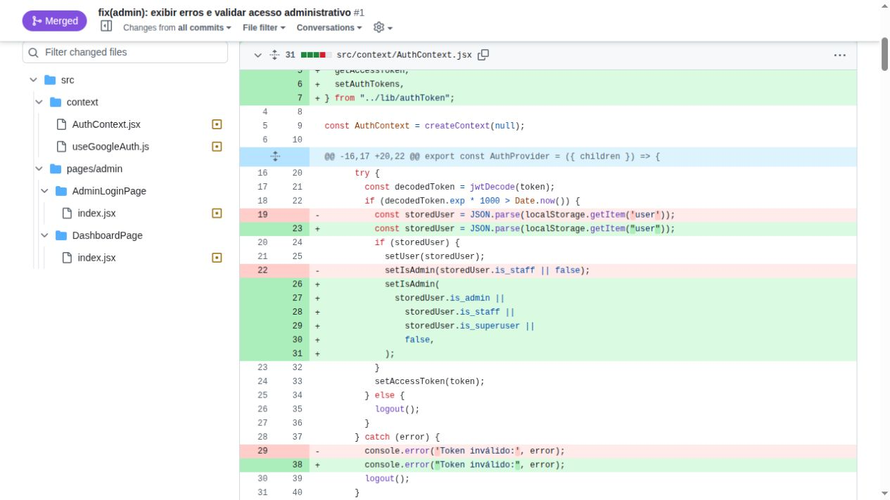
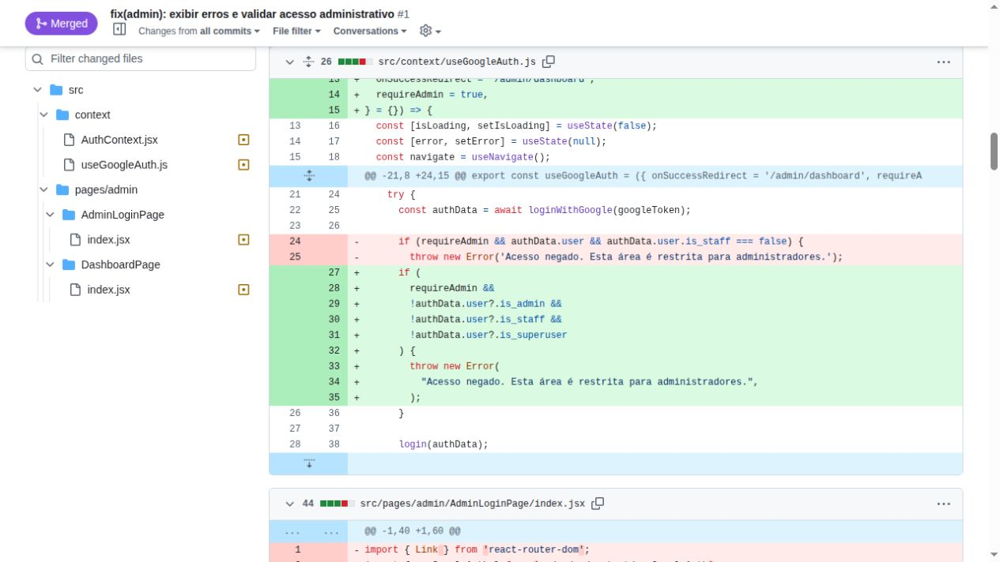
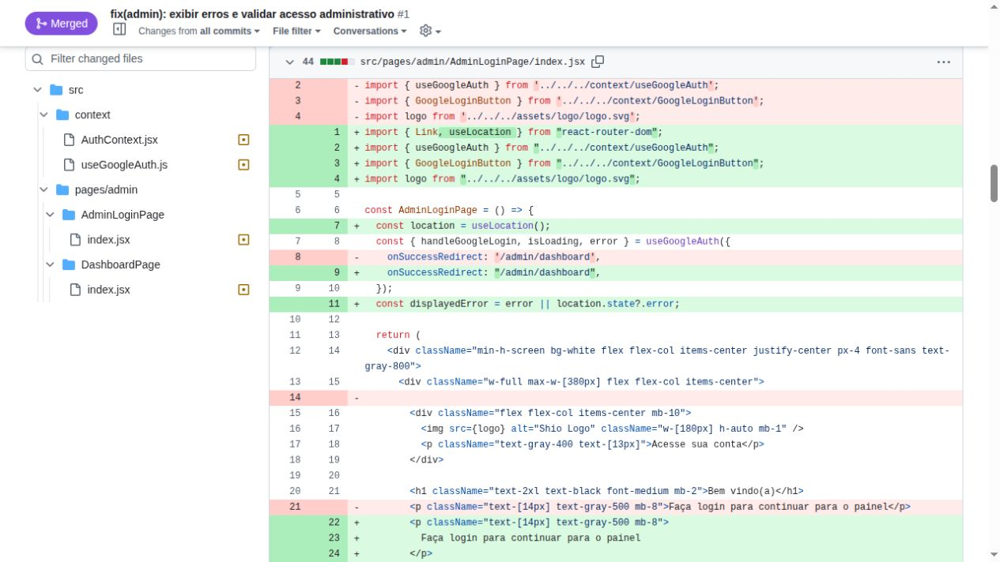
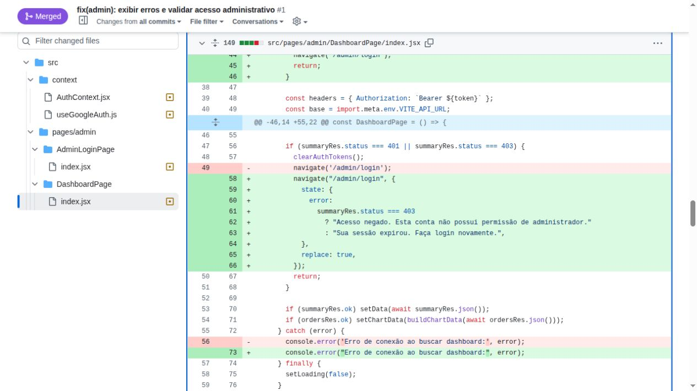
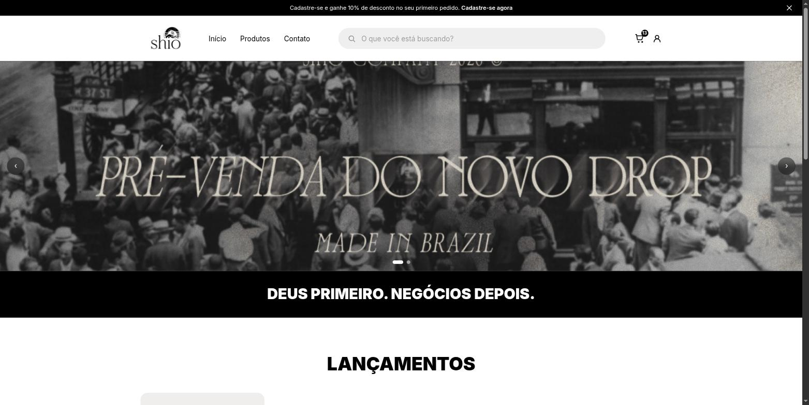
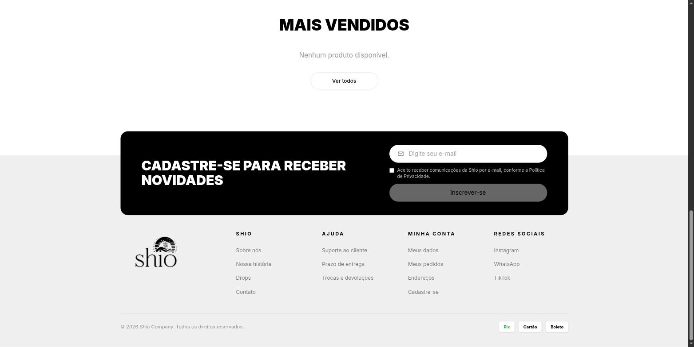
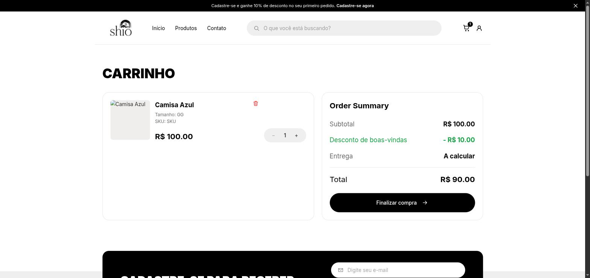
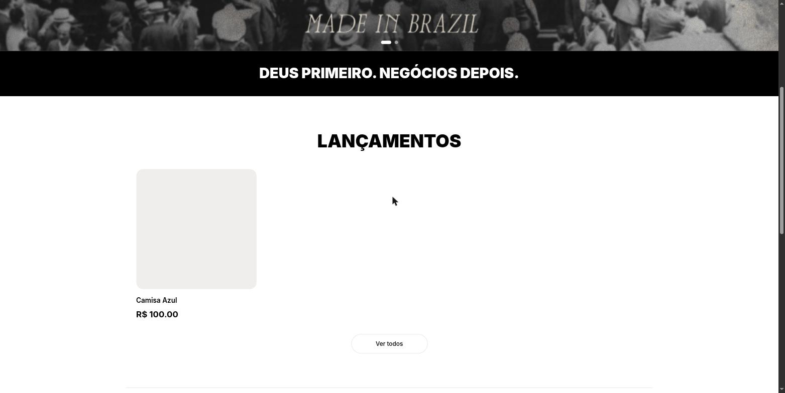

# Evidências

## Login Tradicional e Segurança de Auth
**Trio:** Ian, Arthur, Danilo

**Por que a melhoria foi relevante?** 
Implementamos a autenticação tradicional (E-mail e Senha) para acabar com a dependência exclusiva de contas do Google. Isso democratizou o acesso à plataforma para usuários corporativos e outros provedores. Ao mesmo tempo, corrigimos brechas críticas de segurança: fechamos o roteamento administrativo que estava exposto, implementamos o encerramento real da sessão via backend (Logout API) e arrumamos o sistema de privilégios (`is_staff`).

**Evidências (Pull Requests):**
- [Frontend PR #2](https://github.com/Shio-Enterprise/frontend/pull/2)
- [Backend PR #2](https://github.com/Shio-Enterprise/backend/pull/2)

### Correção complementar de acesso ao painel administrativo

**Responsável:** Matheus de Alcântara

**Origem:** [Issue #20 — Corrigir acesso ao painel administrativo](https://github.com/Shio-Enterprise/Documentacao/issues/20)

**Problema corrigido:**
O frontend reconhecia o perfil administrativo de forma incompleta, priorizando apenas `is_staff`. Isso podia impedir o acesso de uma conta administrativa válida quando a API a identificava por `is_admin` ou `is_superuser`. Além disso, o redirecionamento do dashboard para o login não preservava o motivo da falha.

**Resultado:**
- A sessão armazenada e novas autenticações passaram a reconhecer `is_admin`, `is_staff` e `is_superuser`.
- O login com Google passou a aplicar a mesma regra antes de liberar o painel.
- Respostas `401` limpam a sessão e informam que ela expirou.
- Respostas `403` informam que a conta não possui permissão administrativa.
- A tela de login administrativo exibe a mensagem recebida pelo redirecionamento.

**Evidências:**
- [Frontend PR #1](https://github.com/Shio-Enterprise/frontend/pull/1)
- Commit `fb6a47b` — `fix(painel-admin): mapeia validação de administrador`
- Validação registrada na PR: `npm run build` concluído com sucesso.

**Evidências das alterações no código:**

Capturas do [diff da PR #1](https://github.com/Shio-Enterprise/frontend/pull/1/files), referente ao commit `fb6a47b`. Linhas vermelhas mostram o código removido; linhas verdes mostram o código adicionado.

`AuthContext.jsx`: reconhecimento de `is_admin`, `is_staff` e `is_superuser` ao restaurar a sessão.

`useGoogleAuth.js`: validação dos três indicadores administrativos antes de aceitar o login.

`AdminLoginPage/index.jsx`: leitura da mensagem recebida pelo redirecionamento em `location.state.error`.

`DashboardPage/index.jsx`: envio de mensagens distintas para respostas `401` (sessão expirada) e `403` (acesso negado).

## Promessas comerciais sem suporte no backend
**Trio:** Ian, Arthur e Danilo

**Por que a melhoria foi relevante?**
Seis promessas da UI não tinham suporte real no backend (levantado na [issue #18](https://github.com/Shio-Enterprise/Documentacao/issues/18), decisão do cliente na [issue #19](https://github.com/Shio-Enterprise/Documentacao/issues/19#issuecomment-5618776911)). Implementamos o desconto automático de boas-vindas (10% na primeira compra), a newsletter real com consentimento LGPD, corrigimos os selos de pagamento para refletir o gateway real (InfinitePay: Pix, Cartão, Boleto) e removemos promessas falsas: links de termos/privacidade quebrados, estrelas de avaliação fixas (mockadas) e a promessa de e-mail de confirmação que nunca era enviado.

**Evidências (Pull Requests):**
- [Frontend PR #4](https://github.com/Shio-Enterprise/frontend/pull/4)
- [Backend PR #3](https://github.com/Shio-Enterprise/backend/pull/3)

**Evidências (prints):**

Banner de boas-vindas atualizado para 10%:

Rodapé: newsletter com consentimento LGPD e selos Pix/Cartão/Boleto:

Login sem links quebrados de termos/privacidade (texto simples, sem `<Link>`):

Carrinho aplicando o desconto de boas-vindas automaticamente (sem campo de cupom manual):

Card de produto sem estrelas de avaliação fixas:

