# Evidências

## Sprint 1

## Login Tradicional e Segurança de Auth
**Trio:** Ian, Arthur, Danilo

**Por que a melhoria foi relevante?** 

**Ganho de Negócio:** A implementação da autenticação tradicional (E-mail e Senha) eliminou a dependência exclusiva de contas do Google. Isso foi vital para democratizar o acesso à plataforma, abrindo portas para clientes corporativos (B2B) e usuários que preferem não vincular contas pessoais, o que remove atritos e melhora a taxa de conversão no cadastro e checkout.

**Segurança e Prevenção de Ataques:** Corrigimos uma vulnerabilidade crítica de *Token Replay/Hijacking* no ciclo de vida do JWT. Anteriormente, se um invasor roubasse um *refresh token* válido (ex: via ataque XSS ou interceptação local), ele poderia utilizá-lo indefinidamente para gerar novos acessos à API, mantendo o controle da conta mesmo após o usuário tentar deslogar. Com a nossa implementação de *blacklist* no `TokenRefreshView`, o token antigo é destruído imediatamente no banco de dados e rotacionado a cada uso. Além disso, a validação de privilégios administrativos no front-end era falha, checando apenas `is_staff`. Com o mapeamento correto de `is_admin` e `is_superuser`, blindamos o acesso ao painel contra usuários com permissões mal configuradas.

**Evidências (Pull Requests):**
- [Frontend PR #2](https://github.com/Shio-Enterprise/frontend/pull/2)
- [Backend PR #2](https://github.com/Shio-Enterprise/backend/pull/2)

**Evidências (Prints):**

Nova interface de Login e Cadastro utilizando e-mail e senha:

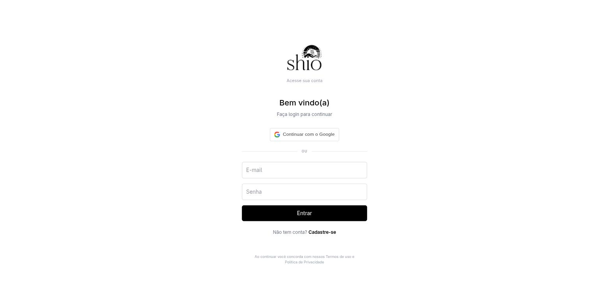

Diff do backend evidenciando a invalidação do JWT antigo e rotação do Refresh Token na renovação:

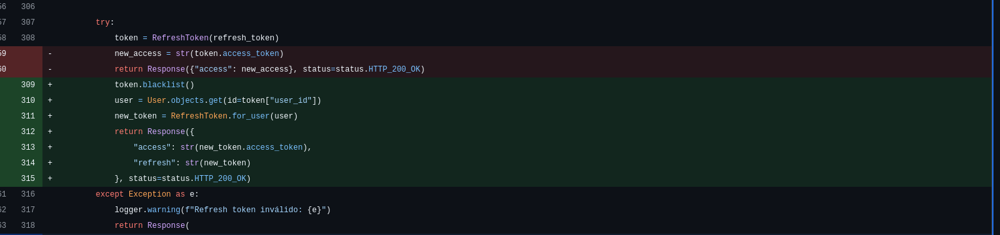

Diff do frontend (`AuthContext`) exibindo a checagem rigorosa de privilégios administrativos:

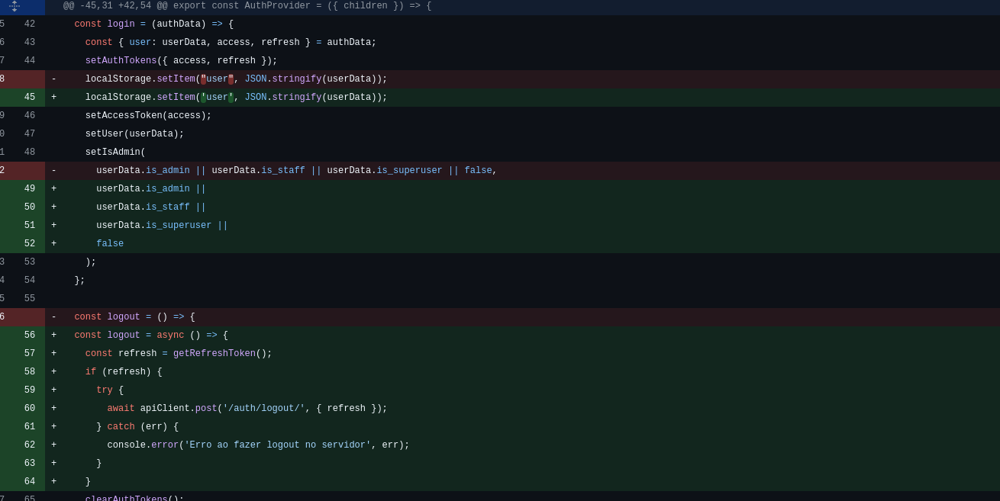

### Correção complementar de acesso ao painel administrativo

**Responsável:** Matheus de Alcântara

**Origem:** [Issue #20 — Corrigir acesso ao painel administrativo](https://github.com/Shio-Enterprise/Documentacao/issues/20)

**Problema corrigido:**
O frontend reconhecia o perfil administrativo de forma incompleta, priorizando apenas `is_staff`. Isso podia impedir o acesso de uma conta administrativa válida quando a API a identificava por `is_admin` ou `is_superuser`. Além disso, o redirecionamento do dashboard para o login não preservava o motivo da falha.

**Resultado:**
- A sessão armazenada e novas autenticações passaram a reconhecer `is_admin`, `is_staff` e `is_superuser`.
- O login com Google passou a aplicar a mesma regra antes de liberar o painel.
- Respostas `401` limpam a sessão e informam que ela expirou.
- Respostas `403` informam que a conta não possui permissão administrativa.
- A tela de login administrativo exibe a mensagem recebida pelo redirecionamento.

**Evidências:**
- [Frontend PR #1](https://github.com/Shio-Enterprise/frontend/pull/1)
- Commit `fb6a47b` — `fix(painel-admin): mapeia validação de administrador`
- Validação registrada na PR: `npm run build` concluído com sucesso.

**Evidências das alterações no código:**

Capturas do [diff da PR #1](https://github.com/Shio-Enterprise/frontend/pull/1/files), referente ao commit `fb6a47b`. Linhas vermelhas mostram o código removido; linhas verdes mostram o código adicionado.

`AuthContext.jsx`: reconhecimento de `is_admin`, `is_staff` e `is_superuser` ao restaurar a sessão.

`useGoogleAuth.js`: validação dos três indicadores administrativos antes de aceitar o login.

`AdminLoginPage/index.jsx`: leitura da mensagem recebida pelo redirecionamento em `location.state.error`.

`DashboardPage/index.jsx`: envio de mensagens distintas para respostas `401` (sessão expirada) e `403` (acesso negado).

## Promessas comerciais sem suporte no backend
**Trio:** Ian, Arthur e Danilo

**Por que a melhoria foi relevante?**
Seis promessas da UI não tinham suporte real no backend (levantado na [issue #18](https://github.com/Shio-Enterprise/Documentacao/issues/18), decisão do cliente na [issue #19](https://github.com/Shio-Enterprise/Documentacao/issues/19#issuecomment-5618776911)). Implementamos o desconto automático de boas-vindas (10% na primeira compra), a newsletter real com consentimento LGPD, corrigimos os selos de pagamento para refletir o gateway real (InfinitePay: Pix, Cartão, Boleto) e removemos promessas falsas: links de termos/privacidade quebrados, estrelas de avaliação fixas (mockadas) e a promessa de e-mail de confirmação que nunca era enviado.

**Evidências (Pull Requests):**
- [Frontend PR #4](https://github.com/Shio-Enterprise/frontend/pull/4)
- [Backend PR #3](https://github.com/Shio-Enterprise/backend/pull/3)

**Evidências (prints):**

Banner de boas-vindas atualizado para 10%:

Rodapé: newsletter com consentimento LGPD e selos Pix/Cartão/Boleto:

Login sem links quebrados de termos/privacidade (texto simples, sem `<Link>`):

Carrinho aplicando o desconto de boas-vindas automaticamente (sem campo de cupom manual):

Card de produto sem estrelas de avaliação fixas:

## O3: Definir política e experiência de disponibilidade dos drops
**Responsável:** Matheus de Alcântara ([@matheusdealcantara](https://github.com/matheusdealcantara)) e Vilmar José Fagundes ([@VilmarFagundes](https://github.com/VilmarFagundes))

**Por que a melhoria foi relevante?**
Antes desta melhoria, a disponibilidade de um drop (campanha limitada de produtos) e a visibilidade dele no catálogo estavam misturadas na mesma flag (`is_active`), o que causava um bug de UX: um drop em Rascunho, Programado, Encerrado ou Esgotado simplesmente sumia da loja, mesmo quando o produto ainda deveria aparecer para o cliente (só sem poder ser comprado). Implementamos uma política única e centralizada que separa dois conceitos — **visível** (aparece no catálogo, depende só de `is_public`) e **vendável** (pode ser comprado, depende de `is_active`, da janela de datas e do limite de unidades `max_quantity`) — e a aplicamos de ponta a ponta: no catálogo, no carrinho e no checkout, com revalidação atômica no momento da compra para impedir concorrência (overselling) entre dois checkouts simultâneos disputando a última unidade de um drop.

**Evidências (Pull Requests):**
- [Backend PR #7](https://github.com/Shio-Enterprise/backend/pull/7)
- [Frontend PR #8](https://github.com/Shio-Enterprise/frontend/pull/8)

**Resultado:**
- Nova política única de disponibilidade (`products/availability.py`) com três níveis: `is_visible` (só depende de `is_public`), `is_open_for_sale` (ativo e dentro da janela de datas) e `is_sellable` (soma o limite `max_quantity`, contado pelas unidades já vendidas em pedidos não cancelados).
- Endpoints de catálogo (`DropCampaign` e `Product`) passaram a expor `is_visible`/`is_sellable`, para o frontend não precisar reimplementar a lógica de datas/limite em JavaScript.
- Um drop Rascunho, Programado, Encerrado ou Esgotado continua aparecendo no catálogo — só o botão de compra fica desabilitado. Apenas `is_public=False` (Privado) oculta o drop de verdade.
- Carrinho e checkout revalidam a disponibilidade no momento da ação (não confiam no estado carregado anteriormente pelo cliente), bloqueando com mensagem clara quando um item deixou de estar disponível entre a montagem do carrinho e a finalização da compra.
- Checkout trava (`select_for_update`) produtos, variações e drops envolvidos antes de checar o limite `max_quantity`, evitando que dois checkouts concorrentes ultrapassem o limite do drop — coberto por teste de concorrência real com threads.
- Admin: formulários de criação/edição de drop ganharam os campos `is_public`, `end_date`, `max_quantity` e `banner`, com validação (ex: `end_date` precisa ser posterior a `launch_date`; `max_quantity` precisa ser um inteiro positivo ou nulo).
- Área pública (catálogo, página de produto, carrinho, pagamento): itens indisponíveis aparecem com indicação visual e o botão de compra/checkout fica bloqueado até o cliente removê-los.

**Evidências (prints):**

Catálogo mostrando produto de um drop em Rascunho (visível, mas com compra desabilitada):

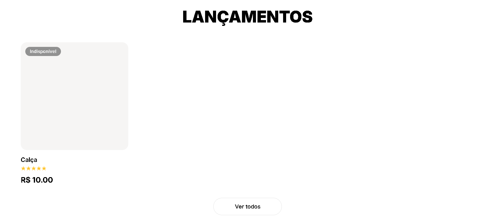

Página do produto com o botão desabilitado:

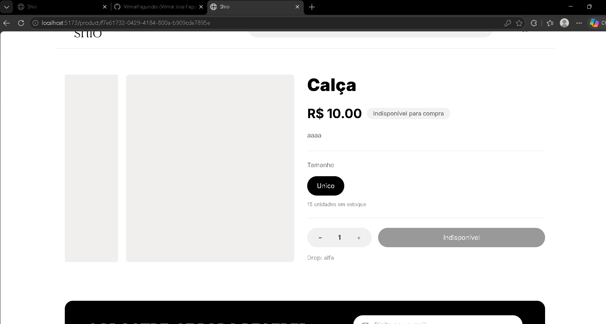

Admin: formulário de criação de drop com os novos campos (visibilidade, data de encerramento, limite de unidades, banner):

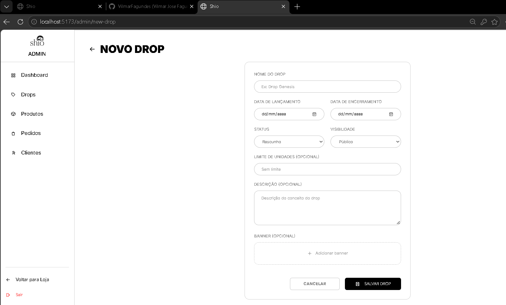

Admin: lista de drops com os status calculados (Rascunho, Programado, Ativo, Encerrado, Esgotado):

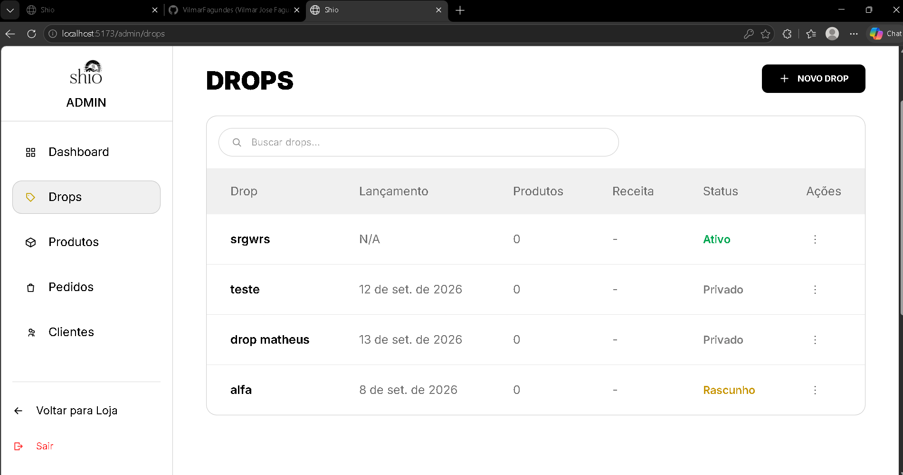

## Consolidação das métricas do dashboard e CRM — O7

**Responsáveis:** Matheus de Alcântara e Vilmar Fagundes

**Origem:**

- [Issue #10 — Definição das regras comerciais](https://github.com/Shio-Enterprise/Documentacao/issues/10)
- [Issue #11 — Consolidação das métricas do CRM e dashboard](https://github.com/Shio-Enterprise/Documentacao/issues/11)

**Por que a melhoria foi relevante?**

O dashboard e o CRM utilizavam critérios diferentes para quantidade de pedidos, receita, gasto e última compra. O gráfico era reconstruído no frontend a partir de uma listagem paginada, e a receita dos drops usava preços atuais de catálogo. A O7 centralizou as regras comerciais no backend e integrou as telas administrativas aos dados consolidados.

**Regras comerciais implementadas:**

- Uma venda positiva exige simultaneamente `Payment.status = PAID` e `CustomerOrder.status = DELIVERED`.
- A competência da venda usa `Payment.paid_at`, registrado na primeira confirmação do pagamento e preservado em mudanças posteriores de status. Para pagamentos antigos pagos ou reembolsados, a migration preenche o campo com `updated_at`.
- A receita total considera `CustomerOrder.total_amount = subtotal + shipping_cost - discount_amount`: inclui frete e deduz descontos. Pagamentos `REFUNDED` subtraem o total do pedido da receita líquida.
- A receita por drop soma `OrderItem.quantity × OrderItem.unit_price` dos itens vinculados ao drop. Frete e desconto não são rateados entre drops.
- As fronteiras dos períodos e as agregações usam `America/Sao_Paulo` (GMT-3).

**Dashboard e CRM:**

- O dashboard oferece somente **Mensal** e **Anual**. Mensal é o padrão, cobre os últimos **30 dias** e agrupa por dia; Anual agrupa por mês.
- Há uma única pesquisa textual por cliente, e-mail, produto, drop ou categoria, sem filtro por status.
- Cards comerciais, série temporal e pedidos recentes compartilham a consulta-base e os filtros. Cards e pontos do gráfico permitem acessar o drill-down paginado; os pedidos são ordenados por `paid_at` decrescente.
- O card aprovado é **Clientes cadastrados**. Não há card de ticket médio no frontend desta entrega.
- O CRM pesquisa somente por nome ou e-mail. Quantidade de pedidos e última compra consideram vendas válidas; o total gasto desconta reembolsos e a última compra usa `paid_at`.
- Cliente recorrente comprou em pelo menos dois drops consecutivos, segundo a ordem de lançamento.
- O `order_history` pode mostrar todos os pedidos do cliente, distinguindo venda válida (`VALID_SALE`), pedido sem receita (`NOT_REVENUE`) e reembolso (`REFUNDED`).

**Evidências (Pull Requests) e situação da integração:**

- [Frontend PR #9](https://github.com/Shio-Enterprise/frontend/pull/9): mesclado na `dev`, commit `626281d`.
- [Backend PR #8](https://github.com/Shio-Enterprise/backend/pull/8): aberto e aguardando aprovação na consulta de 15/09/2026 (America/Sao_Paulo). O handoff registra o commit `3aa0750`, sem conflitos com a `dev`; a integração do backend ainda está pendente.

**Validações registradas no handoff e nos PRs:**

- Backend: **10/10 testes unitários específicos** em `orders/test_o7_metrics.py`, lint dos arquivos alterados aprovado e `makemigrations --check --dry-run` sem migration pendente.
- Os testes abrangem persistência e backfill de `paid_at`, agregação anual, fronteira de timezone, paginação e ordenação, pesquisa textual, recorrência, histórico comercial, receita por drop e reembolsos.
- Frontend: testes de componente do dashboard e CRM aprovados. A suíte registrada no PR teve **20 testes aprovados** e **3 falhas preexistentes de login** por ausência de `GoogleOAuthProvider` no ambiente de teste.
- Esses resultados são os registros da implementação; as suítes não foram reexecutadas nesta atualização documental. As imagens de testes abaixo mostram suas asserções, não um relatório de execução.
- Exportação ficou fora do escopo. Testes E2E foram adiados para outra sprint/PR e não compõem estas evidências.

### Evidências dos trechos de código do backend

Capturas reais da aba [Files changed do PR #8](https://github.com/Shio-Enterprise/backend/pull/8/files), recortadas para priorizar o código e os números de linha. Verde indica adições e vermelho indica remoções. As capturas do frontend estão restritas ao dashboard, na seção seguinte.

**Regra de venda válida, timezone e período padrão — `orders/metrics.py`.** O predicado exige pedido entregue e pagamento confirmado; reembolsos são identificados separadamente. O período padrão passa a ser mensal, com 30 dias.

**Consulta compartilhada e receita líquida — `orders/metrics.py`.** O intervalo filtra `payment__paid_at`; vendas e reembolsos passam pelos mesmos filtros. `revenue_value` retorna o total negativo para reembolsos.

**Primeira confirmação do pagamento — `orders/models.py`.** O método `save` preenche `paid_at` somente se ainda estiver vazio, inclusive quando a atualização usa `update_fields`.

**Compatibilidade com pagamentos existentes — `orders/migrations/0003_payment_paid_at.py`.** A migration adiciona o campo indexado e usa `updated_at` como referência para registros antigos pagos ou reembolsados.

**Agregação do dashboard — `orders/views.py`.** A implementação anterior é substituída pela consulta consolidada, separando receita de vendas válidas e valor reembolsado antes de calcular a receita líquida.

**Drill-down paginado — `orders/views.py`.** O detalhamento reutiliza `metric_orders`, ordena por `-payment__paid_at` e pagina a resposta com `PageNumberPagination`.

**Métricas comerciais do CRM — `authentication/views.py`.** A quantidade usa vendas válidas, o total gasto subtrai reembolsos e a última compra utiliza a maior data de confirmação do pagamento.

**Teste da receita por drop — `orders/test_o7_metrics.py`.** Um pedido com itens de R$ 60,00 e R$ 40,00, frete de R$ 20,00 e desconto de R$ 10,00 deve gerar R$ 110,00 no dashboard, preservando R$ 60,00 e R$ 40,00 para os respectivos drops.

**Teste de reembolso no dashboard e CRM — `orders/test_o7_metrics.py`.** Uma venda de R$ 100,00 e um reembolso de R$ 30,00 devem resultar em R$ 70,00 no total, na série temporal e no gasto do cliente, mantendo apenas uma venda positiva na contagem.

### Evidências visuais do dashboard

Capturas manuais de `localhost:5173/admin/dashboard`, com os dados demonstrativos já existentes no ambiente. Não foram incluídas telas de login, CRM ou drops, nem capturas do código do frontend.

As novas capturas foram feitas com o backend da O7 em funcionamento. Elas mostram os cards, a série temporal populada, a alternância entre os períodos e a aplicação da pesquisa textual.

**Mensal:** estado inicial com pesquisa única, ausência de filtro de status, card **Clientes cadastrados** e série diária populada.

**Anual:** opção Anual selecionada, período de 365 dias, agregação mensal e série populada.

**Pesquisa textual:** campo único preenchido com “Ana”, com cards, gráfico e pedidos recentes refletindo o resultado filtrado.

## Catálogo, busca e paginação server-side

**Trio:** Amanda, Felipe e Cauã

**Por que a melhoria foi relevante?**

Conforme identificado na [issue #25](https://github.com/Shio-Enterprise/Documentacao/issues/25), o catálogo ignorava a categoria definida na rota, carregava somente a primeira página de produtos e executava busca, filtros, ordenação e paginação no front-end. Além disso, “Mais vendidos” não utilizava vendas reais e as recomendações não consideravam categoria, drop e disponibilidade. Para resolver esses problemas, o catálogo passou a consultar o backend com os parâmetros de busca, filtros, ordenação e paginação, mantendo o estado na URL e respeitando o slug da categoria. Também foi implementado o ranking de produtos com base nas quantidades de pedidos válidos e um endpoint de recomendações que considera categoria, drop, vendas e estoque, mantendo produtos inativos fora das listagens públicas.

**Evidências (Pull Requests):**

- [Frontend PR #4](https://github.com/Shio-Enterprise/frontend/pull/6)
- [Backend PR #3](https://github.com/Shio-Enterprise/backend/pull/5)

**Evidências (Prints):**

Rota de categoria carregando os produtos correspondentes:

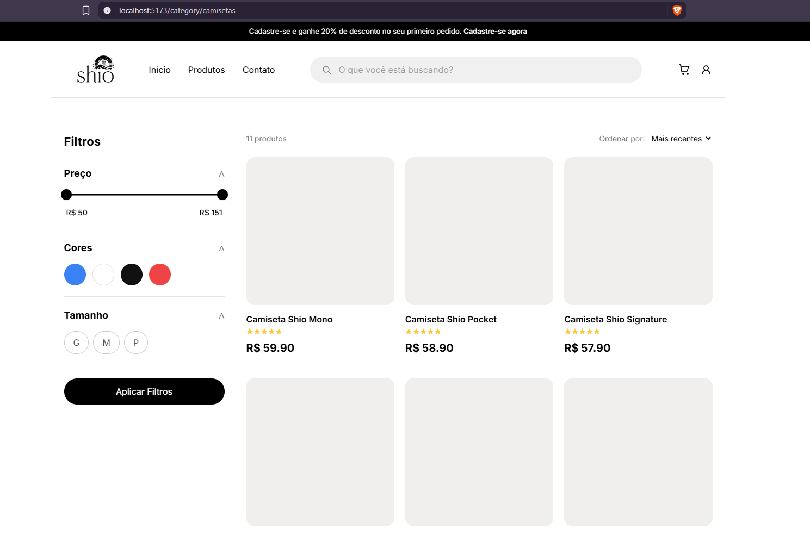

Paginação server-side com a página 2 selecionada:

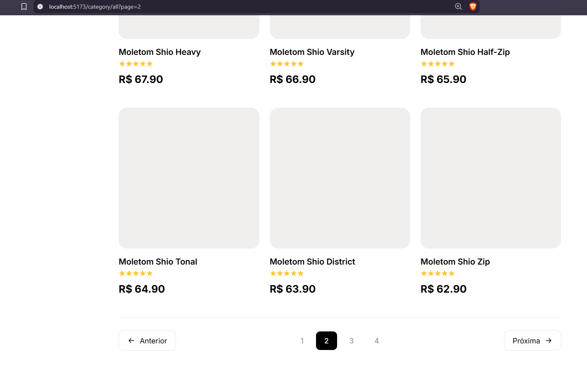

Filtros, busca, ordenação e página enviados na consulta da API:

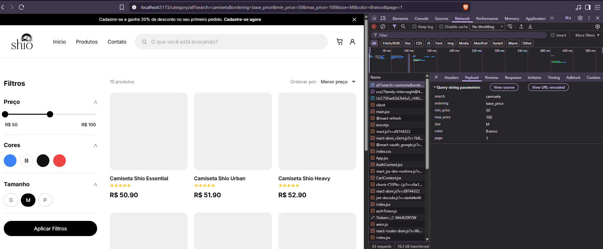

Recomendações carregadas pelo endpoint específico do produto:

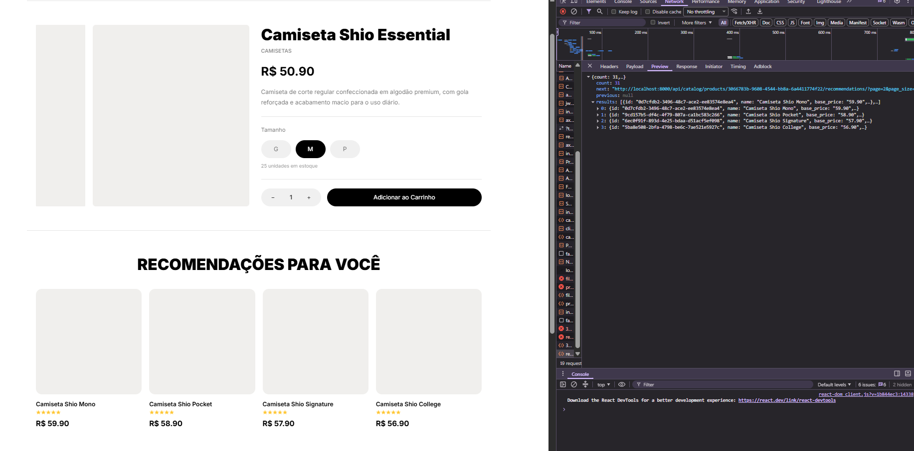

Catálogo ordenado pelo ranking de mais vendidos:

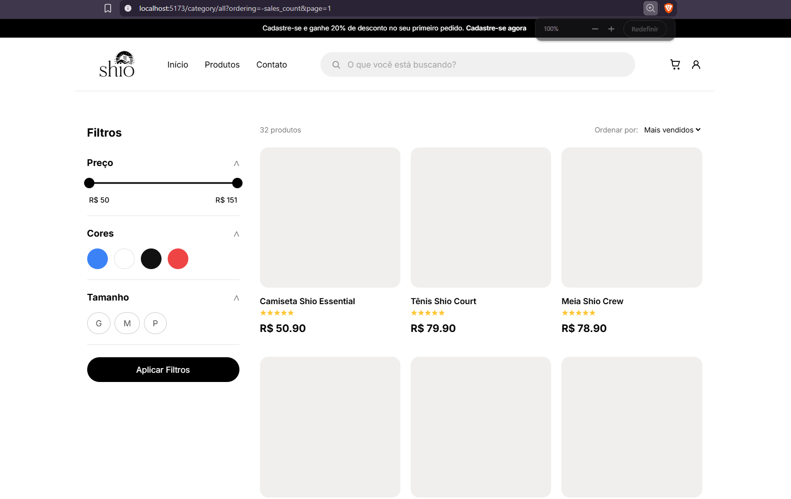

## Expiração automática de reserva de estoque no checkout — O2
**Responsável:** João Gabriel e Pedro Augusto

**Origem:**
- Diagnóstico consolidado do projeto (documento de análise inicial), item O2: ausência de proteção contra concorrência e contra carrinhos abandonados no checkout.
- Sem issue de definição própria publicada: a solução de concorrência e reversão de estoque já havia sido implementada pela branch `feat/o6-ciclo-pedidos` enquanto o O2 estava em desenvolvimento em paralelo, em cima de uma base desatualizada. O trabalho foi replanejado para reutilizar o que a O6 já entregou, em vez de duplicar a solução.

**Por que a melhoria foi relevante?**
O checkout debitava o estoque sem proteção contra concorrência e sem nunca devolvê-lo quando o cliente abandonava a compra antes de pagar. A O6, já mesclada na `dev`, resolveu a concorrência e a reversão de estoque (`move_stock`, `restore_order_stock`, `update_status` com máquina de estados via `ALLOWED_TRANSITIONS`), mas a devolução de estoque só acontece quando alguém muda o status do pedido manualmente. Pedidos `AWAITING_PAYMENT` abandonados (cliente fecha a aba, cai a conexão, desiste no meio do pagamento) ficavam com o estoque debitado indefinidamente, sem que ninguém cancelasse.

**Regras implementadas:**
- `CustomerOrder` recebeu o campo `reservation_expires_at`, gravado na criação do pedido como `timezone.now() + STOCK_RESERVATION_TTL_MINUTES`.
- `STOCK_RESERVATION_TTL_MINUTES` é configurável por variável de ambiente, com valor padrão de 30 minutos.
- A verificação de expiração é *lazy* (sem job em background, já que o projeto não possui Celery/cron): ocorre sempre que o pedido é consultado, em `UserOrderDetailView.get()` e `AdminOrderDetailView.get()`.
- Um pedido `AWAITING_PAYMENT` com prazo vencido é cancelado via `update_status(order, CANCELED, ...)`, reaproveitando o `restore_order_stock` já existente da O6 — nenhuma lógica de reversão de estoque foi duplicada.
- Pedidos com prazo ainda válido, ou sem prazo definido (pedidos criados antes desta mudança), não são afetados.

**Evidências (Pull Request) e situação da integração:**
- [Backend PR #9](https://github.com/Shio-Enterprise/backend/pull/9): aberto contra a `dev`, commit `4de9a2b`.

**Validações registradas no PR:**
- 3 testes automatizados novos em `orders/tests.py` (`StockReservationExpirationTests`), cobrindo: gravação do prazo no checkout, cancelamento e devolução de estoque em pedido expirado (confirmado via `StockMovement` de `DEVOLUCAO`), e não interferência em pedido com prazo ainda válido.
- Suíte completa executada com `make test`: os 3 testes novos passam. A execução também aponta 6 falhas pré-existentes na `dev`, confirmadas como não relacionadas a este PR (reproduzidas de forma idêntica na `dev` sem nenhuma alteração desta entrega) — originadas na branch `O3-Aplicar-disponibilidade-e-escassez-dos-drops`.
- `ruff check` sem erros nas partes alteradas por este PR.

### Evidências dos trechos de código do backend

**Campo de expiração no pedido — `orders/models.py`.** `CustomerOrder` recebe `reservation_expires_at`, opcional, usado como prazo da reserva de estoque.
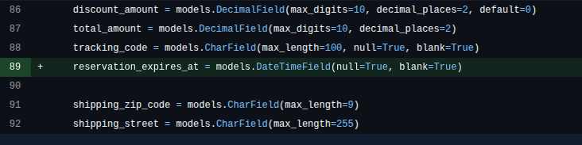

**Verificação lazy de expiração — `orders/services.py`.** `release_if_expired` cancela o pedido vencido reaproveitando `update_status`, sem duplicar a lógica de reversão de estoque da O6.
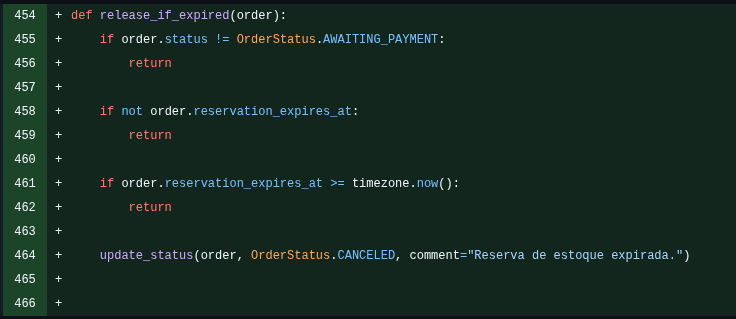

**Prazo gravado no checkout — `orders/views.py`.** `reservation_expires_at` é definido na criação do pedido, usando o TTL configurável em `STOCK_RESERVATION_TTL_MINUTES`.
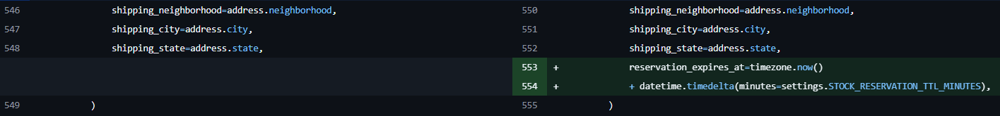

**Teste de expiração e devolução de estoque — `orders/tests.py`.** Um pedido com prazo vencido, ao ser consultado, é cancelado e o estoque debitado na venda é devolvido via `StockMovement` de `DEVOLUCAO`.
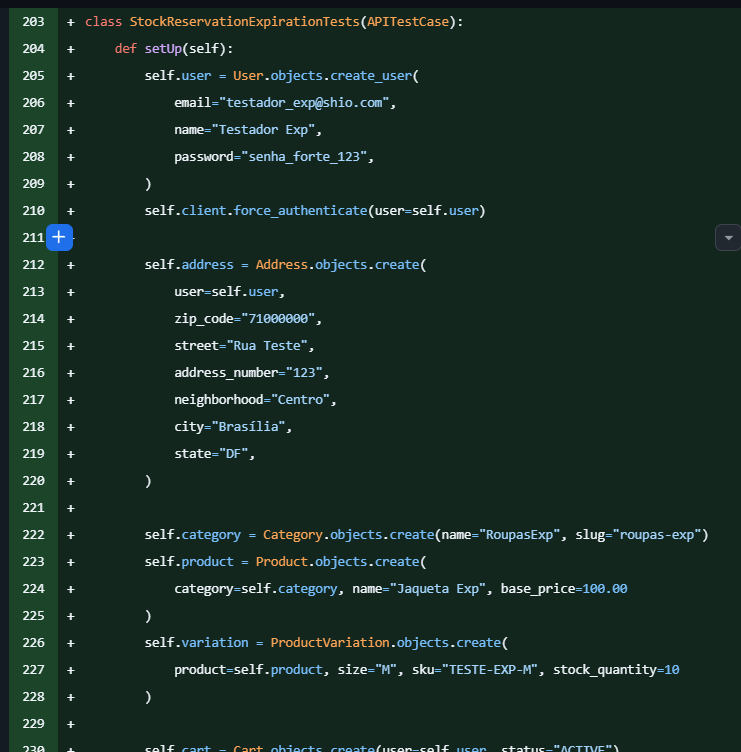
