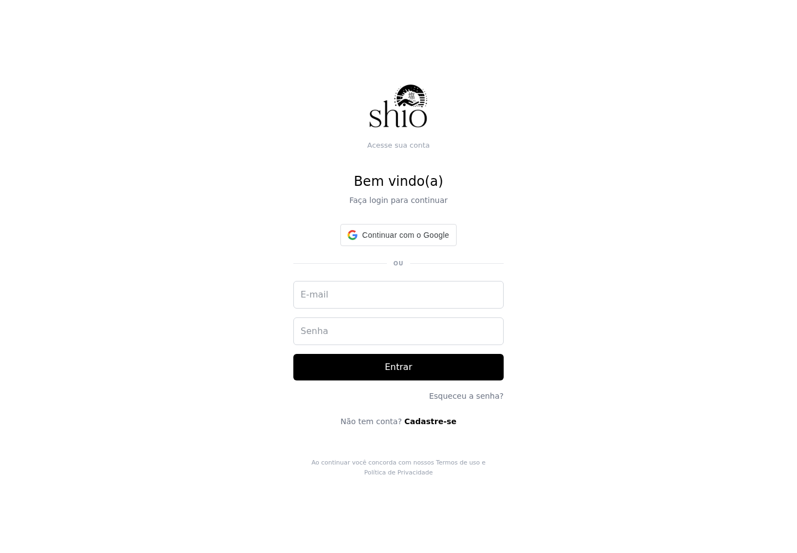
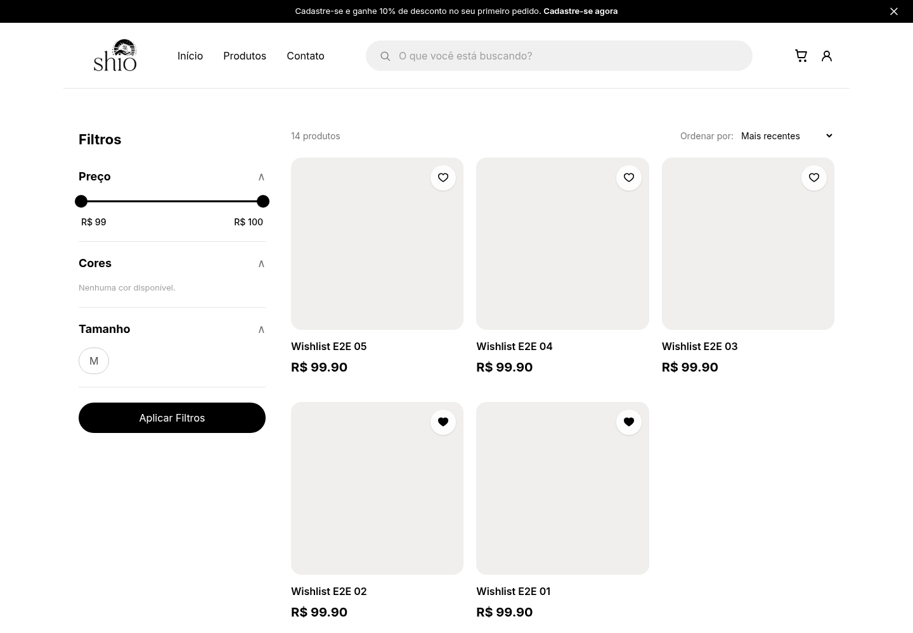
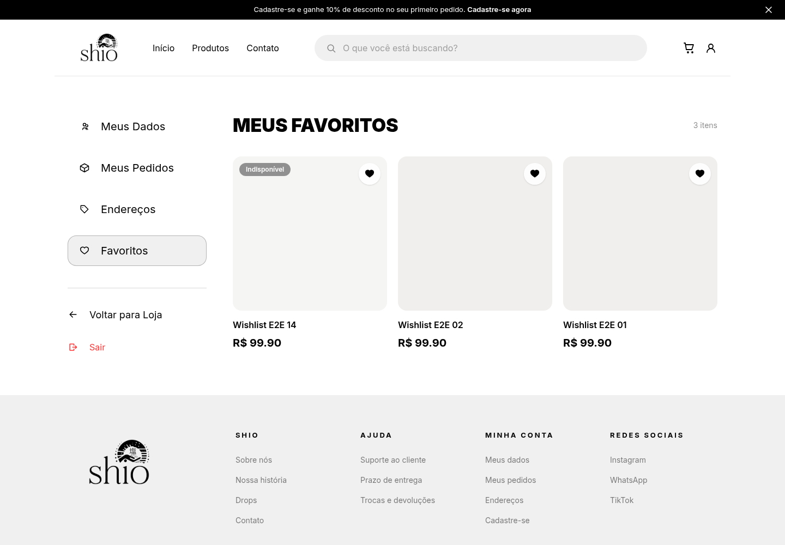
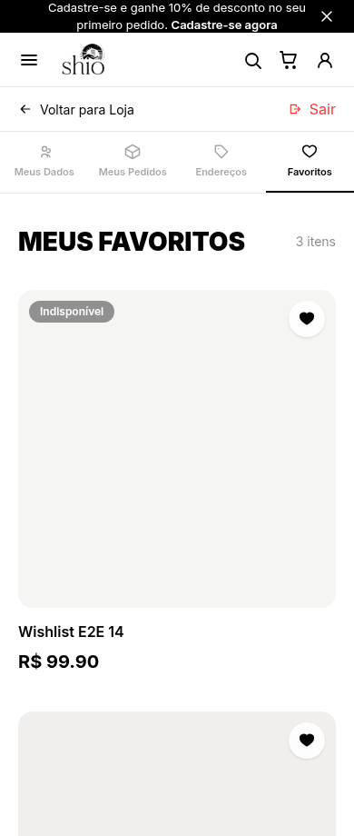
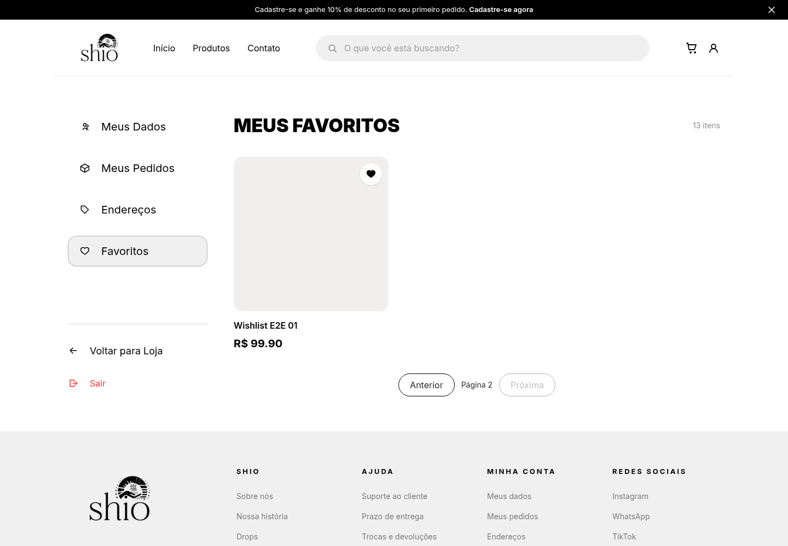
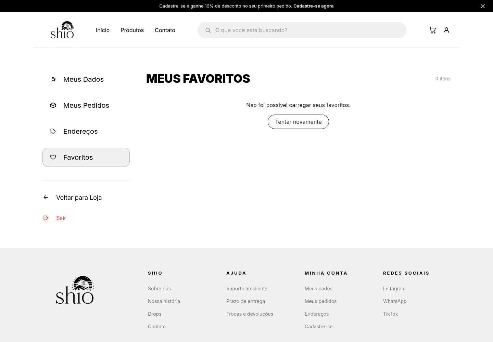
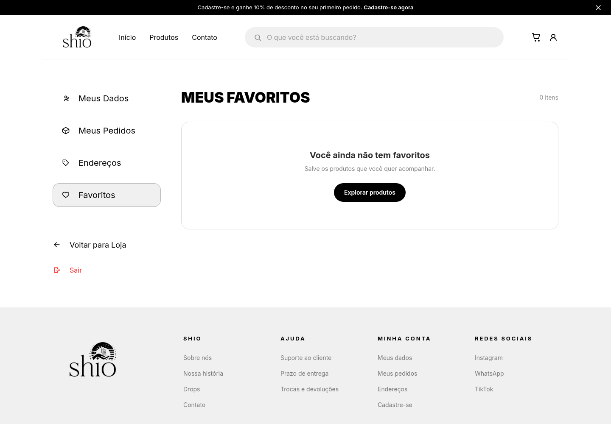

# Favoritos — evidências visuais

**Data:** 7 de outubro de 2026  
**Referência:** [Issue #37 — Favoritos de produtos com lista em Minha conta](https://github.com/Shio-Enterprise/Documentacao/issues/37)

Capturas do navegador Chrome acessando o frontend local e a API Django real, com PostgreSQL 15 em banco isolado. Backend na revisão `ff3149f` e frontend na revisão `f883938`, ambos na branch `feat/37-favoritos-produtos`.

Os produtos `Wishlist E2E` e a conta são fictícios. Os blocos cinza são os espaços de imagem dos produtos de teste, que não possuem fotos cadastradas; não indicam carregamento pendente. Nenhuma resposta de sucesso da API foi simulada. Apenas o cenário de erro interrompe deliberadamente uma requisição no navegador.

## 1. Coração no catálogo público

Na segunda página do catálogo filtrado, os cards exibem o coração desmarcado para visitantes. O botão é independente do link de acesso ao produto.


## 2. Autenticação exigida

Ao clicar no coração do produto 01 sem sessão, o visitante é encaminhado à tela de login. Após autenticar, a navegação retorna ao catálogo de origem. A inclusão é feita por um novo clique no coração.



## 3. Produtos adicionados aos favoritos

Os produtos 01 e 02 foram adicionados pela interface. Após recarregar a rota do catálogo, seus corações continuam preenchidos; os demais permanecem desmarcados.



## 4. Lista em Minha conta — desktop

O acesso pelo ícone de conta e pelo menu **Favoritos** abre `/my-favorites`. A lista apresenta três itens, preço e ação de remoção. O produto 14 foi incluído por uma requisição autenticada fora da página e apareceu ao abrir a lista, com o selo **Indisponível** por estar sem estoque.



## 5. Lista em Minha conta — mobile

Com viewport de **390 × 920**, o menu da conta passa para navegação horizontal e os cards são apresentados em uma coluna. A captura mostra o início da lista; foi verificada a ausência de rolagem horizontal no documento.



## 6. Persistência após sair e entrar

Depois de recarregar a página, sair da conta e autenticar novamente, os mesmos três favoritos continuam presentes. O roteiro verificou a remoção do token local após sair antes de realizar o novo login.


## 7. Paginação e remoção na última página

Com 13 favoritos cadastrados pela API real, o botão **Próxima** leva à página 2, que contém o item mais antigo. A última página desabilita o avanço. Após remover esse item pela interface, a lista retornou à página anterior com 12 itens.



## 8. Falha de rede e nova tentativa

A requisição de listagem foi interrompida de forma controlada pelo navegador. A página exibiu a mensagem de erro e o botão **Tentar novamente**. Depois de retirar a interrupção e clicar no botão, os produtos voltaram a aparecer com a resposta da API real.

O contador de zero mostrado durante o erro é o estado da tela sem uma listagem carregada; os 12 vínculos continuavam no banco.



## 9. Remoção e estado vazio

Todos os 12 itens restantes foram removidos pelos corações da página, com conferência do contador após cada remoção. Ao final, a interface apresentou a mensagem **Você ainda não tem favoritos** e o botão **Explorar produtos**.



## Roteiro e rastreabilidade

As capturas foram geradas pelo roteiro `scripts/capturar-favoritos.cjs`, na raiz deste repositório. Os [metadados das capturas](assets/evidencias-favoritos/capturas.json) registram revisões, rotas e dimensões. As imagens desktop têm **1440 × 1000** pixels.

Para repetir, prepare um PostgreSQL descartável com as variáveis `WISHLIST_TEST_DB_*` esperadas pelo backend, aplique as migrations com `core.settings.wishlist_e2e` e execute `backend/scripts/seed_wishlist_e2e.py` pelo shell do Django. Suba a API em `127.0.0.1:8037` e o frontend em `127.0.0.1:5137`, configurando `VITE_API_URL=http://127.0.0.1:8037`. Com Playwright disponível, execute na raiz de Documentacao:

```bash
PLAYWRIGHT_MODULE=/caminho/node_modules/playwright \
CHROME_PATH=/usr/bin/google-chrome \
node scripts/capturar-favoritos.cjs
```

O roteiro cria uma conta exclusiva de demonstração, inclui e remove favoritos somente nela e sobrescreve as capturas. Os endereços aceitos são locais. A execução concluída não registrou erros JavaScript não tratados.

Estas evidências registram os fluxos descritos e não substituem testes de unicidade, isolamento entre usuários, concorrência ou a execução das suítes completas. O [relatório de 5 de outubro](favoritos-pendencias.md) permanece como registro histórico da revisão anterior.
