## O7: Consolidação das métricas do dashboard e CRM

**Responsáveis:** Matheus de Alcântara e Vilmar Fagundes

**Origem:**

- [Issue #10 — Definição das regras comerciais](https://github.com/Shio-Enterprise/Documentacao/issues/10)
- [Issue #11 — Consolidação das métricas do CRM e dashboard](https://github.com/Shio-Enterprise/Documentacao/issues/11)

**Por que a melhoria foi relevante?**

O dashboard e o CRM utilizavam critérios diferentes para quantidade de pedidos, receita, gasto e última compra. O gráfico era reconstruído no frontend a partir de uma listagem paginada, e a receita dos drops usava preços atuais de catálogo. A O7 centralizou as regras comerciais no backend e integrou as telas administrativas aos dados consolidados.

**Regras comerciais implementadas:**

- Uma venda positiva exige simultaneamente `Payment.status = PAID` e `CustomerOrder.status = DELIVERED`.
- A competência da venda usa `Payment.paid_at`, registrado na primeira confirmação do pagamento e preservado em mudanças posteriores de status. Para pagamentos antigos pagos ou reembolsados, a migration preenche o campo com `updated_at`.
- A receita total considera `CustomerOrder.total_amount = subtotal + shipping_cost - discount_amount`: inclui frete e deduz descontos. Pagamentos `REFUNDED` subtraem o total do pedido da receita líquida.
- A receita por drop soma `OrderItem.quantity × OrderItem.unit_price` dos itens vinculados ao drop. Frete e desconto não são rateados entre drops.
- As fronteiras dos períodos e as agregações usam `America/Sao_Paulo` (GMT-3).

**Dashboard e CRM:**

- O dashboard oferece somente **Mensal** e **Anual**. Mensal é o padrão, cobre os últimos **30 dias** e agrupa por dia; Anual agrupa por mês.
- Há uma única pesquisa textual por cliente, e-mail, produto, drop ou categoria, sem filtro por status.
- Cards comerciais, série temporal e pedidos recentes compartilham a consulta-base e os filtros. Cards e pontos do gráfico permitem acessar o drill-down paginado; os pedidos são ordenados por `paid_at` decrescente.
- O card aprovado é **Clientes cadastrados**. Não há card de ticket médio no frontend desta entrega.
- O CRM pesquisa somente por nome ou e-mail. Quantidade de pedidos e última compra consideram vendas válidas; o total gasto desconta reembolsos e a última compra usa `paid_at`.
- Cliente recorrente comprou em pelo menos dois drops consecutivos, segundo a ordem de lançamento.
- O `order_history` pode mostrar todos os pedidos do cliente, distinguindo venda válida (`VALID_SALE`), pedido sem receita (`NOT_REVENUE`) e reembolso (`REFUNDED`).

**Evidências (Pull Requests) e situação da integração:**

- [Frontend PR #9](https://github.com/Shio-Enterprise/frontend/pull/9): mesclado na `dev`, commit `626281d`.
- [Backend PR #8](https://github.com/Shio-Enterprise/backend/pull/8): aberto e aguardando aprovação na consulta de 15/09/2026 (America/Sao_Paulo). O handoff registra o commit `3aa0750`, sem conflitos com a `dev`; a integração do backend ainda está pendente.

**Validações registradas no handoff e nos PRs:**

- Backend: **10/10 testes unitários específicos** em `orders/test_o7_metrics.py`, lint dos arquivos alterados aprovado e `makemigrations --check --dry-run` sem migration pendente.
- Os testes abrangem persistência e backfill de `paid_at`, agregação anual, fronteira de timezone, paginação e ordenação, pesquisa textual, recorrência, histórico comercial, receita por drop e reembolsos.
- Frontend: testes de componente do dashboard e CRM aprovados. A suíte registrada no PR teve **20 testes aprovados** e **3 falhas preexistentes de login** por ausência de `GoogleOAuthProvider` no ambiente de teste.
- Esses resultados são os registros da implementação; as suítes não foram reexecutadas nesta atualização documental. As imagens de testes abaixo mostram suas asserções, não um relatório de execução.
- Exportação ficou fora do escopo. Testes E2E foram adiados para outra sprint/PR e não compõem estas evidências.

### Evidências dos trechos de código do backend

Capturas reais da aba [Files changed do PR #8](https://github.com/Shio-Enterprise/backend/pull/8/files), recortadas para priorizar o código e os números de linha. Verde indica adições e vermelho indica remoções. As capturas do frontend estão restritas ao dashboard, na seção seguinte.

**Regra de venda válida, timezone e período padrão — `orders/metrics.py`.** O predicado exige pedido entregue e pagamento confirmado; reembolsos são identificados separadamente. O período padrão passa a ser mensal, com 30 dias.

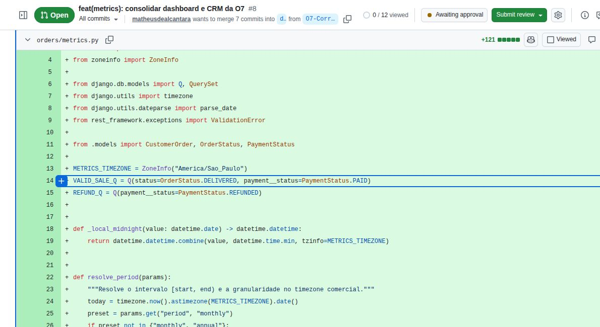

**Consulta compartilhada e receita líquida — `orders/metrics.py`.** O intervalo filtra `payment__paid_at`; vendas e reembolsos passam pelos mesmos filtros. `revenue_value` retorna o total negativo para reembolsos.

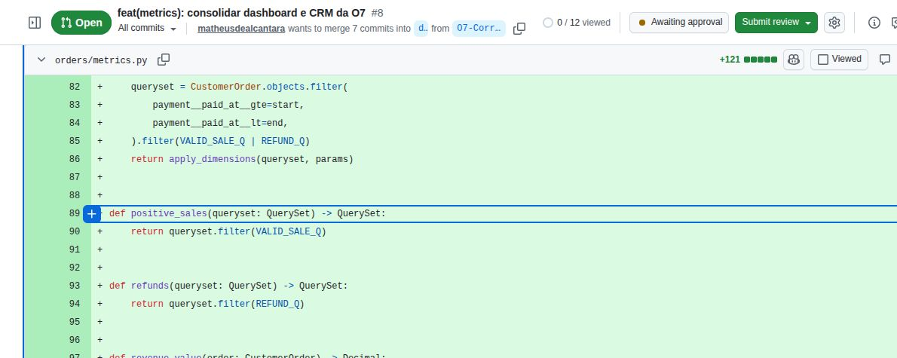

**Primeira confirmação do pagamento — `orders/models.py`.** O método `save` preenche `paid_at` somente se ainda estiver vazio, inclusive quando a atualização usa `update_fields`.

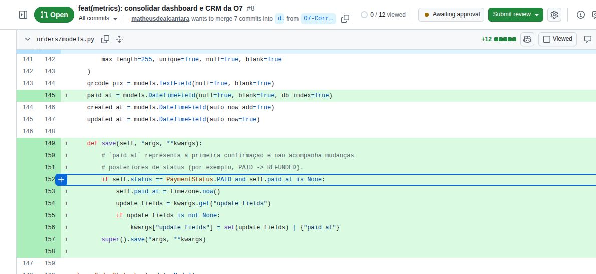

**Compatibilidade com pagamentos existentes — `orders/migrations/0003_payment_paid_at.py`.** A migration adiciona o campo indexado e usa `updated_at` como referência para registros antigos pagos ou reembolsados.

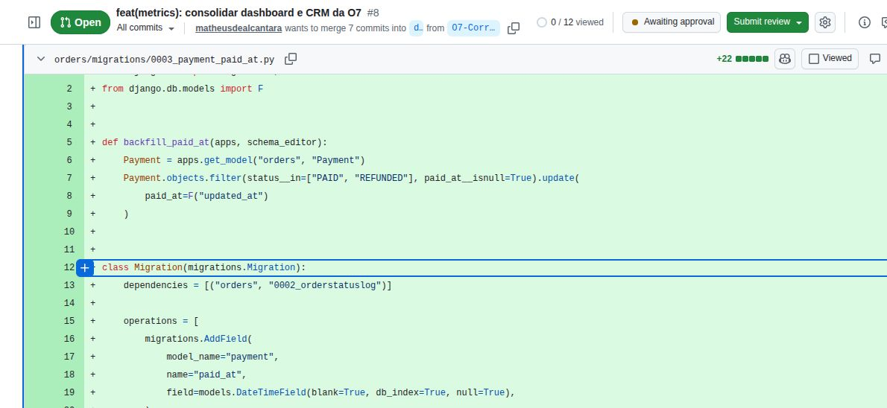

**Agregação do dashboard — `orders/views.py`.** A implementação anterior é substituída pela consulta consolidada, separando receita de vendas válidas e valor reembolsado antes de calcular a receita líquida.

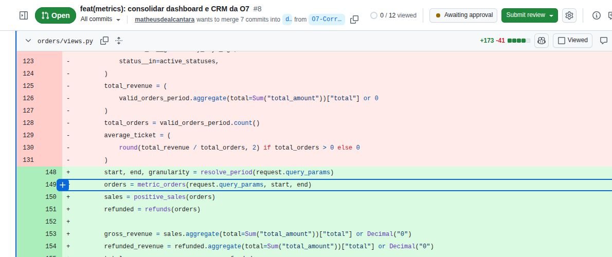

**Drill-down paginado — `orders/views.py`.** O detalhamento reutiliza `metric_orders`, ordena por `-payment__paid_at` e pagina a resposta com `PageNumberPagination`.

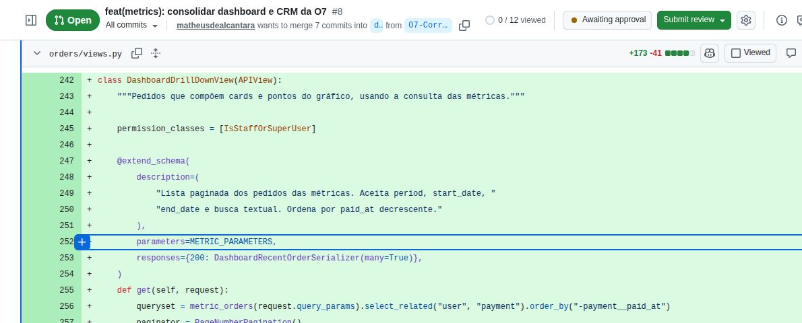

**Métricas comerciais do CRM — `authentication/views.py`.** A quantidade usa vendas válidas, o total gasto subtrai reembolsos e a última compra utiliza a maior data de confirmação do pagamento.

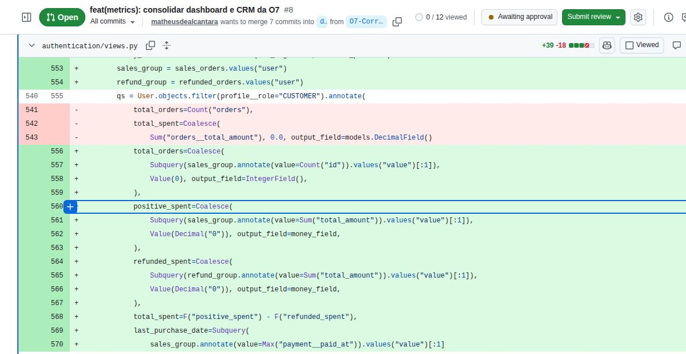

**Teste da receita por drop — `orders/test_o7_metrics.py`.** Um pedido com itens de R$ 60,00 e R$ 40,00, frete de R$ 20,00 e desconto de R$ 10,00 deve gerar R$ 110,00 no dashboard, preservando R$ 60,00 e R$ 40,00 para os respectivos drops.

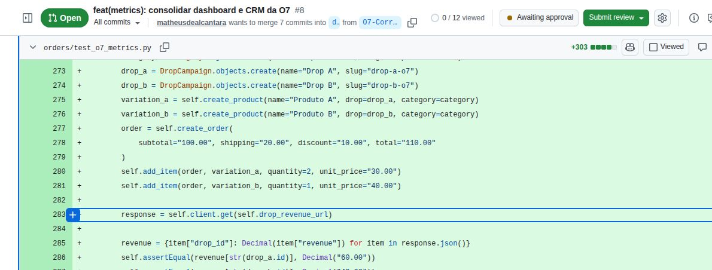

**Teste de reembolso no dashboard e CRM — `orders/test_o7_metrics.py`.** Uma venda de R$ 100,00 e um reembolso de R$ 30,00 devem resultar em R$ 70,00 no total, na série temporal e no gasto do cliente, mantendo apenas uma venda positiva na contagem.

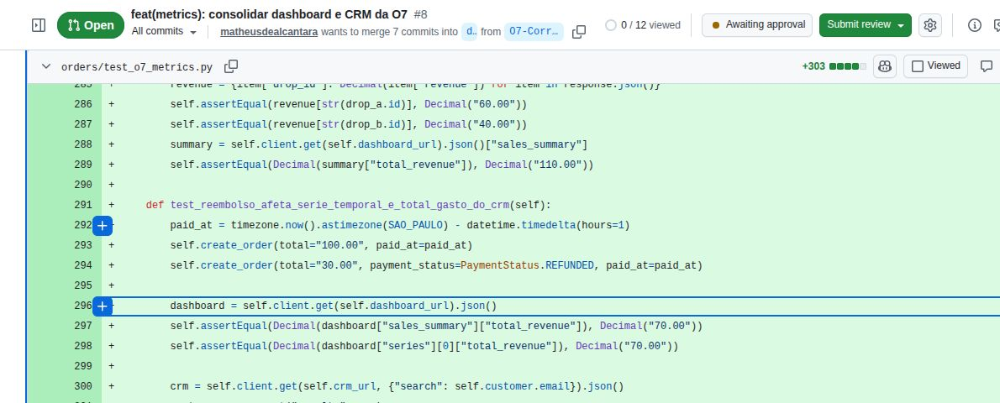

### Evidências visuais do dashboard

Capturas manuais de `localhost:5173/admin/dashboard`, com os dados demonstrativos já existentes no ambiente. Não foram incluídas telas de login, CRM ou drops, nem capturas do código do frontend.

As novas capturas foram feitas com o backend da O7 em funcionamento. Elas mostram os cards, a série temporal populada, a alternância entre os períodos e a aplicação da pesquisa textual.

**Mensal:** estado inicial com pesquisa única, ausência de filtro de status, card **Clientes cadastrados** e série diária populada.

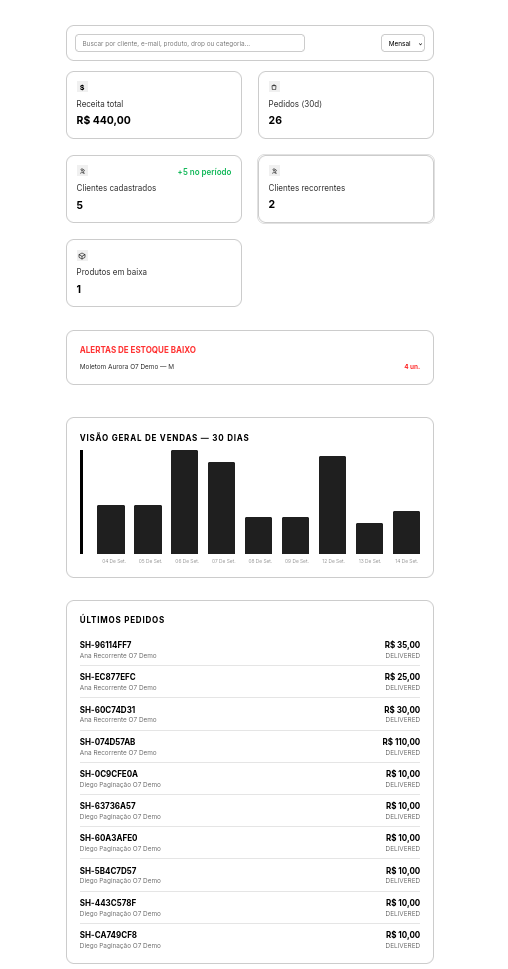

**Anual:** opção Anual selecionada, período de 365 dias, agregação mensal e série populada.

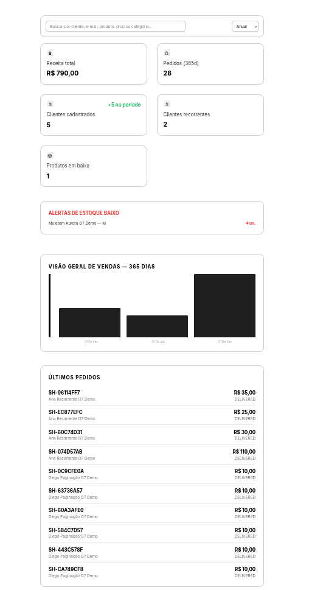

**Pesquisa textual:** campo único preenchido com “Ana”, com cards, gráfico e pedidos recentes refletindo o resultado filtrado.

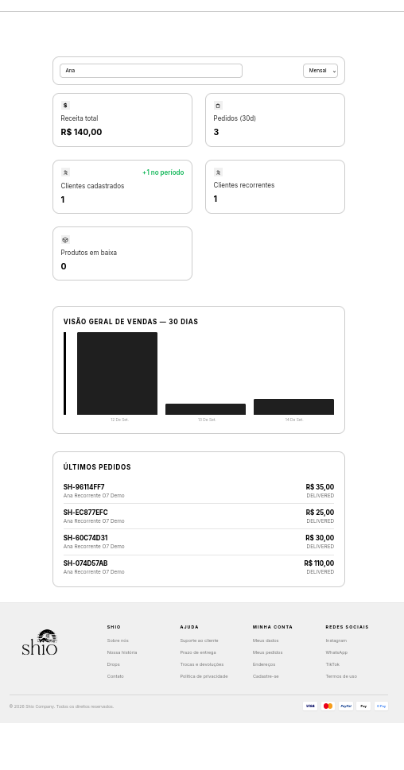

-------- Corrigir

### Correção complementar de acesso ao painel administrativo

**Responsável:** Matheus de Alcântara

**Origem:** [Issue #20 — Corrigir acesso ao painel administrativo](https://github.com/Shio-Enterprise/Documentacao/issues/20)

**Problema corrigido:**
O frontend reconhecia o perfil administrativo de forma incompleta, priorizando apenas `is_staff`. Isso podia impedir o acesso de uma conta administrativa válida quando a API a identificava por `is_admin` ou `is_superuser`. Além disso, o redirecionamento do dashboard para o login não preservava o motivo da falha.

**Resultado:**
- A sessão armazenada e novas autenticações passaram a reconhecer `is_admin`, `is_staff` e `is_superuser`.
- O login com Google passou a aplicar a mesma regra antes de liberar o painel.
- Respostas `401` limpam a sessão e informam que ela expirou.
- Respostas `403` informam que a conta não possui permissão administrativa.
- A tela de login administrativo exibe a mensagem recebida pelo redirecionamento.

**Evidências:**
- [Frontend PR #1](https://github.com/Shio-Enterprise/frontend/pull/1)
- Commit `fb6a47b` — `fix(painel-admin): mapeia validação de administrador`
- Validação registrada na PR: `npm run build` concluído com sucesso.

**Evidências das alterações no código:**

Capturas do [diff da PR #1](https://github.com/Shio-Enterprise/frontend/pull/1/files), referente ao commit `fb6a47b`. Linhas vermelhas mostram o código removido; linhas verdes mostram o código adicionado.

`AuthContext.jsx`: reconhecimento de `is_admin`, `is_staff` e `is_superuser` ao restaurar a sessão.

`useGoogleAuth.js`: validação dos três indicadores administrativos antes de aceitar o login.

`AdminLoginPage/index.jsx`: leitura da mensagem recebida pelo redirecionamento em `location.state.error`.

`DashboardPage/index.jsx`: envio de mensagens distintas para respostas `401` (sessão expirada) e `403` (acesso negado).

