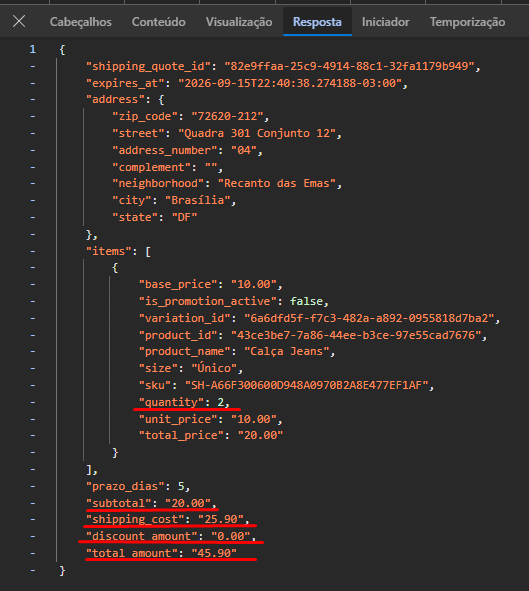
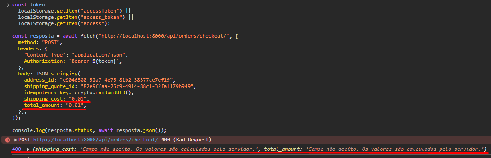
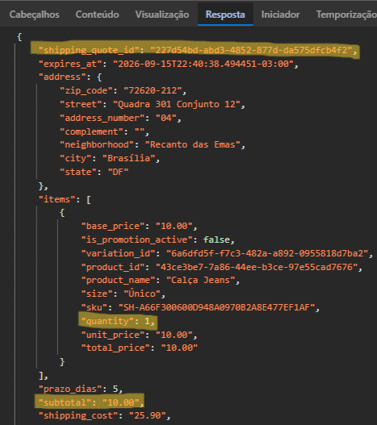
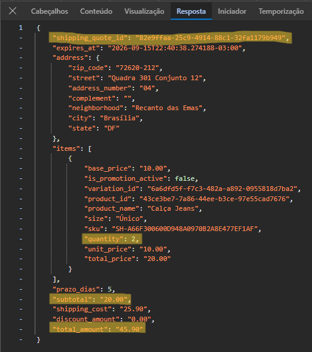
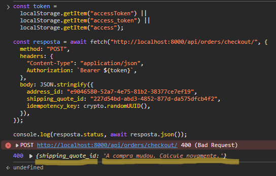
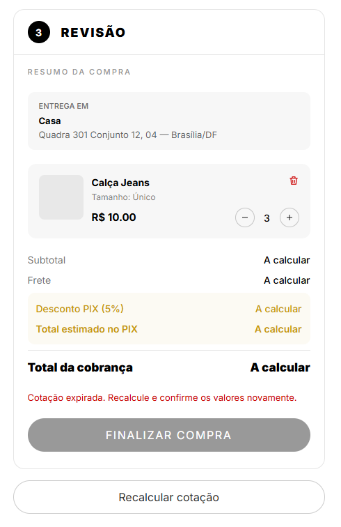
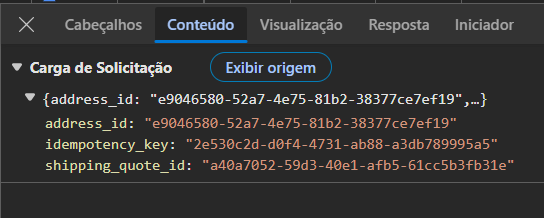

## Checkout seguro com cálculo autoritativo, cotação persistida e idempotência
**Trio:** Amanda, Felipe e Cauã

**Por que a melhoria foi relevante?**

O checkout confiava em valores financeiros enviados pelo frontend, permitindo que frete e total fossem alterados pelo cliente. Além disso, uma cotação poderia deixar de representar o carrinho atual e requisições repetidas poderiam iniciar mais de uma tentativa para a mesma compra. A O1 centralizou no backend o cálculo de subtotal, frete, desconto e total, passou a persistir cotações vinculadas ao usuário, endereço e conteúdo do carrinho, com prazo de validade, e adotou uma chave de idempotência no checkout. No frontend, a finalização passou a depender de uma cotação válida, enquanto valores expirados ou desatualizados bloqueiam a compra e exigem novo cálculo. Com isso, o pedido usa uma única fonte de verdade para os valores e reduz o risco de manipulação e duplicidade.

**Evidências (Pull Requests):**
- [Frontend PR #12](https://github.com/Shio-Enterprise/frontend/pull/12)
- [Backend PR #11](https://github.com/Shio-Enterprise/backend/pull/11)

**Evidências (Prints):**

Resposta da cotação com subtotal, frete, desconto e total calculados pelo backend:

Tentativa de enviar `shipping_cost` e `total_amount` adulterados rejeitada pela API:

Cotação registrada antes da alteração do carrinho, com uma unidade do produto:

Nova cotação criada após a mudança de quantidade, refletindo o novo subtotal e total:

Tentativa de finalizar a compra com a cotação anterior rejeitada porque o carrinho foi alterado:

Frontend bloqueando a finalização após a expiração da cotação e oferecendo o recálculo:

Payload do checkout contendo apenas `address_id`, `shipping_quote_id` e `idempotency_key`, sem valores financeiros calculados pelo cliente:

