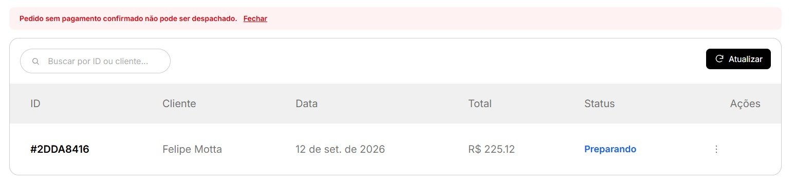
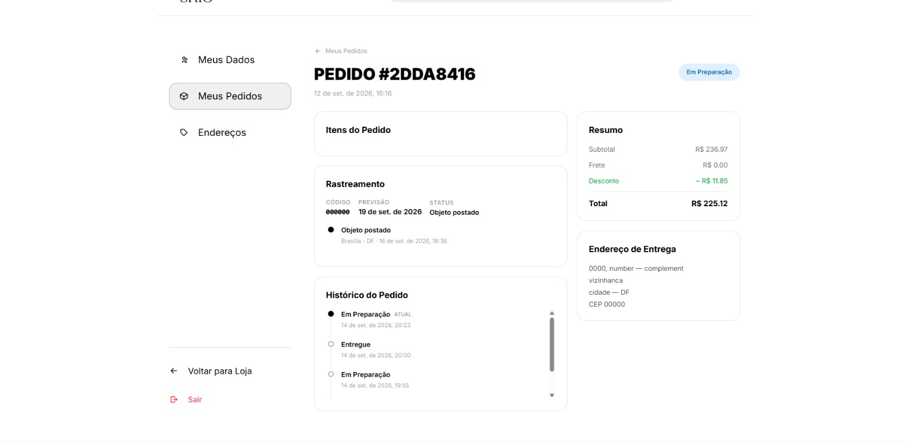
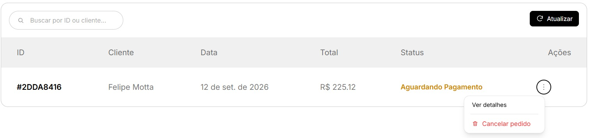
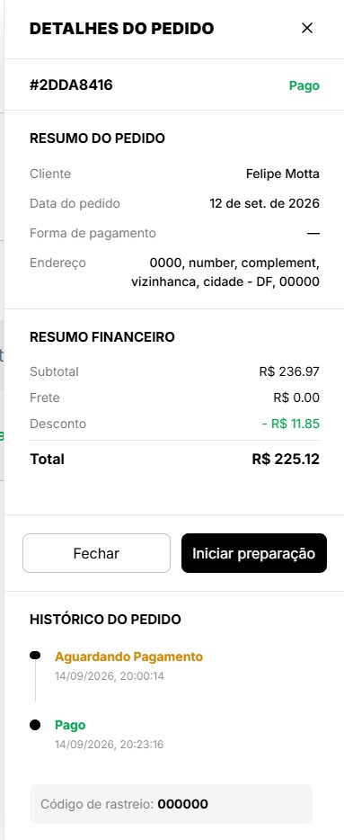

## O6: Ciclo operacional seguro de pedidos — O6
**Trio:** Amanda, Felipe e Cauã

**Por que a melhoria foi relevante?**

O ciclo dos pedidos não possuía uma regra única para controlar as mudanças de status, o que permitia tentar pular etapas, despachar pedidos sem pagamento confirmado e registrar históricos inconsistentes. A melhoria centralizou no backend uma máquina de estados que aceita somente as transições válidas entre aguardando pagamento, pago, em preparação, enviado, entregue e cancelado. Cada mudança real gera um único registro no histórico, o despacho pelos Correios exige pagamento confirmado e o código de rastreio é tratado sem criar transições artificiais. No frontend administrativo, cada pedido apresenta somente a ação compatível com seu estado atual. Para o cliente, o detalhe do pedido passou a exibir o histórico em ordem cronológica, o status atual e as informações de rastreamento.

**Evidências (Pull Requests):**
- [Frontend PR #7](https://github.com/Shio-Enterprise/frontend/pull/7)
- [Backend PR #6](https://github.com/Shio-Enterprise/backend/pull/6)

**Evidências (Prints):**

Tentativa de despachar um pedido sem pagamento confirmado bloqueada pelo sistema:

Página do cliente exibindo status atual, rastreamento e histórico do pedido:

Pedido aguardando pagamento com apenas as ações compatíveis com seu estado, incluindo o cancelamento:

Pedido pago com a ação de iniciar preparação e histórico das mudanças de status:

