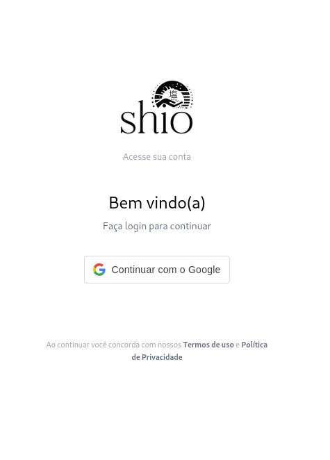

## Login Tradicional e Segurança de Auth
**Trio:** Ian, Arthur, Danilo

**Por que a melhoria foi relevante?** 

**Ganho de Negócio:** A implementação da autenticação tradicional (E-mail e Senha) eliminou a dependência exclusiva de contas do Google. Isso foi vital para democratizar o acesso à plataforma, abrindo portas para clientes corporativos (B2B) e usuários que preferem não vincular contas pessoais, o que remove atritos e melhora a taxa de conversão no cadastro e checkout.

**Segurança e Prevenção de Ataques:** Corrigimos uma vulnerabilidade crítica de *Token Replay/Hijacking* no ciclo de vida do JWT. Anteriormente, se um invasor roubasse um *refresh token* válido (ex: via ataque XSS ou interceptação local), ele poderia utilizá-lo indefinidamente para gerar novos acessos à API, mantendo o controle da conta mesmo após o usuário tentar deslogar. Com a nossa implementação de *blacklist* no `TokenRefreshView`, o token antigo é destruído imediatamente no banco de dados e rotacionado a cada uso. Além disso, a validação de privilégios administrativos no front-end era falha, checando apenas `is_staff`. Com o mapeamento correto de `is_admin` e `is_superuser`, blindamos o acesso ao painel contra usuários com permissões mal configuradas.

**Evidências (Pull Requests):**
- [Frontend PR #2](https://github.com/Shio-Enterprise/frontend/pull/2)
- [Backend PR #2](https://github.com/Shio-Enterprise/backend/pull/2)

**Evidências (Prints):**

Interface antiga de login:

Nova interface de Login e Cadastro utilizando e-mail e senha:

Diff do backend evidenciando a invalidação do JWT antigo e rotação do Refresh Token na renovação:

Diff do frontend (`AuthContext`) exibindo a checagem rigorosa de privilégios administrativos:

