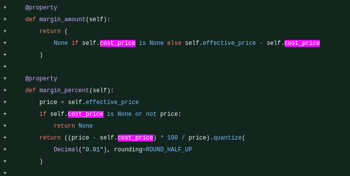
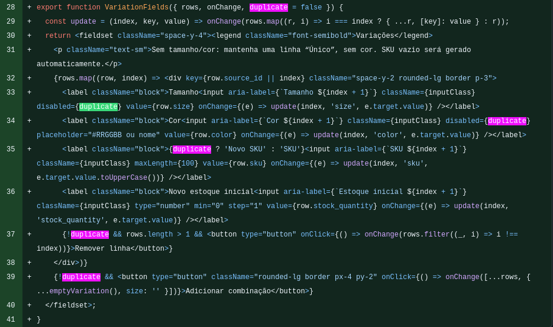
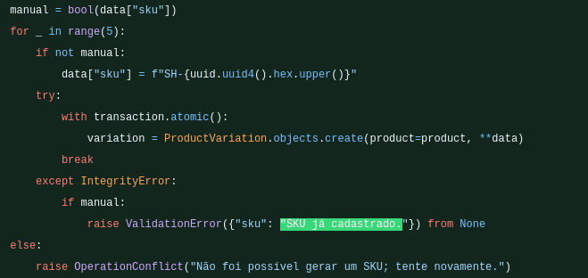
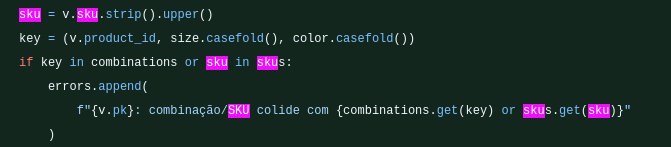
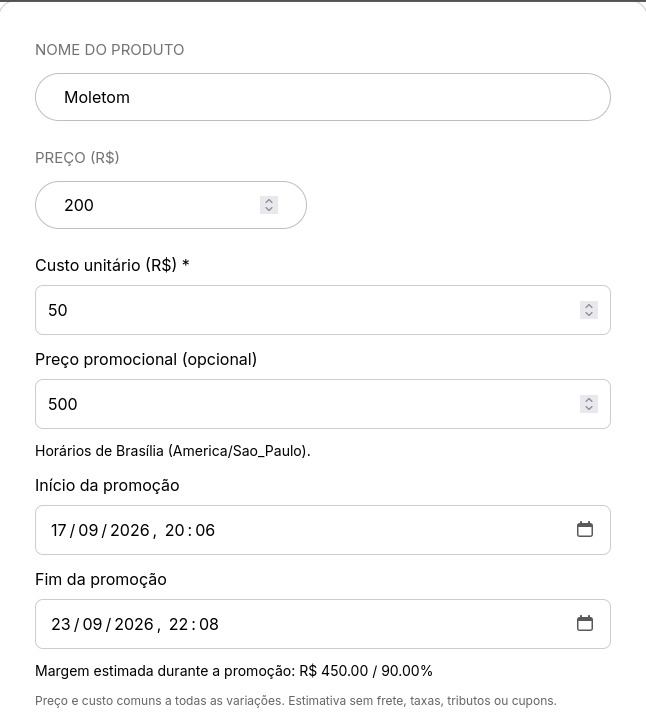
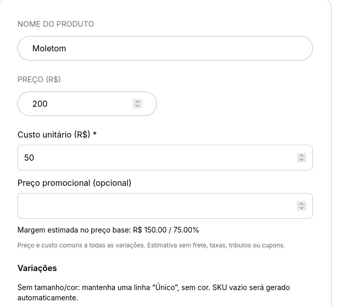
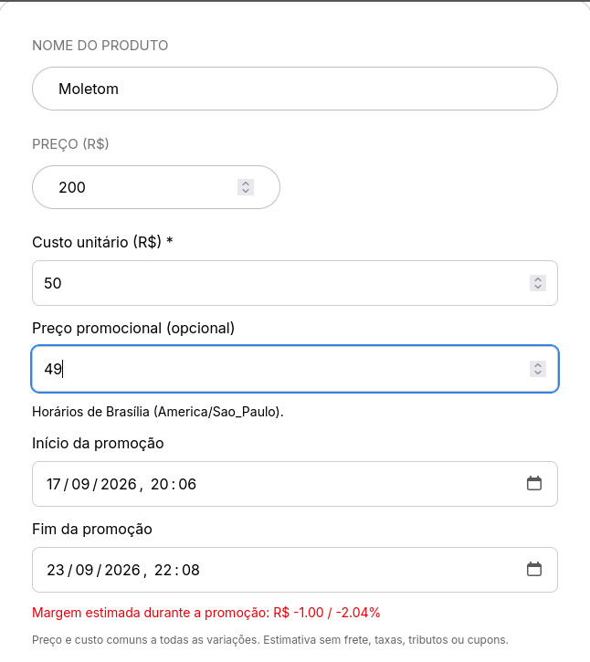
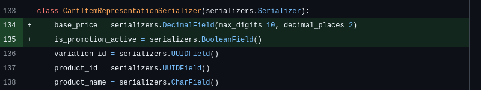
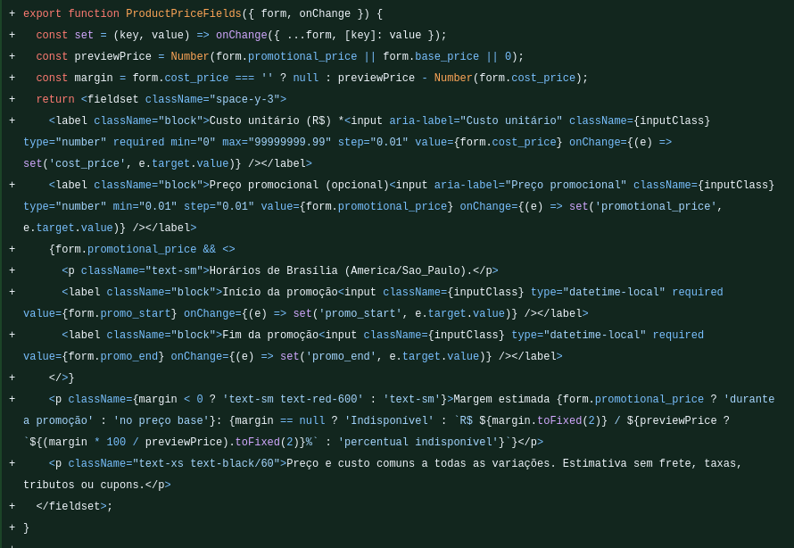

## Modelo de Custos, Promoções e Rastreabilidade de Estoque

**Responsável:** Danilo Naves

**Origem:** História O8 - Definição do modelo de custo, preço promocional.

**Por que a melhoria foi relevante?**

**Ganho de Negócio:**
O cadastro de produtos não possuía uma representação adequada do custo de aquisição, dificultando a análise da margem obtida em cada venda. Além disso, o preço promocional informado pelo painel administrativo não era tratado de forma completa pelo backend, fazendo com que promoções e seus períodos de validade não fossem refletidos corretamente em todo o fluxo de compra.

A implementação passou a distinguir **preço base**, **preço promocional** e **custo do produto**, permitindo calcular e visualizar a margem estimada diretamente no painel administrativo. O preço efetivamente utilizado pela aplicação também passou a considerar automaticamente a vigência da promoção, evitando divergências entre cadastro, carrinho e checkout.

**Cadastro e integridade das variações:**
O fluxo de criação de produtos e variações foi revisado para garantir maior consistência entre tamanho, cor e SKU.

A duplicação de produtos passou a preservar os atributos das variações, como tamanho e cor, permitindo ao usuário informar novos SKUs para o produto duplicado. Dessa forma, a duplicação não reutiliza inadvertidamente identificadores já existentes e mantém as características do produto original.

Também foram adicionadas validações para impedir combinações duplicadas de tamanho e cor dentro de um mesmo produto.

**Experiência no painel administrativo:**

No frontend, o cadastro de produtos passou a apresentar:

* campo de **custo unitário**;
* campo opcional de **preço promocional**;
* período de início e término da promoção;
* cálculo da **margem estimada em valor e percentual**;
* indicação visual para margem negativa;

O contrato de preço promocional também passou a enviar `promotional_price`, `promo_start` e `promo_end`, considerando os horários no fuso `America/Sao_Paulo`.

**Resultado:**

* O produto passou a possuir informação de custo para análise de margem.
* Promoções passaram a possuir período explícito de validade.
* O preço utilizado no carrinho e no checkout respeita a promoção vigente.
* O estoque inicial passa a fazer parte do histórico de movimentações.
* Alterações de estoque são rastreáveis por meio do ledger.
* Cancelamentos e devoluções podem gerar movimentos de reversão relacionados à movimentação original.
* A criação de produtos e suas variações ganhou maior consistência transacional.
* Combinações repetidas de tamanho e cor são rejeitadas.
* A duplicação preserva os atributos das variações e permite definir novos SKUs.
* O painel administrativo passou a apresentar custo e margem estimada antes do cadastro ou alteração do produto.

**Testes adicionados:**

Foram incluídos testes para os principais comportamentos introduzidos pela história, incluindo:

* tratamento de preço promocional e seu período de validade;
* serialização das datas de promoção;
* cálculo e apresentação de margem;
* comportamento quando o custo ainda não existe em produtos legados;
* preservação das cores durante a duplicação;
* definição independente dos novos SKUs;
* movimentações de estoque associadas às operações do sistema;
* consistência das operações de estoque e checkout.

**Evidências — Commits principais da implementação:**

* [Backend — commit `8dbc719`](https://github.com/Shio-Enterprise/backend/commit/8dbc7192ed3f54b19cba1a0df56bf63ae676019b) — `feat: modelo de custos, margens, auditoria de estoque (ledger) e integridade de checkout`.
* [Frontend — commit `a1b40ab`](https://github.com/Shio-Enterprise/frontend/commit/a1b40ab9684e009e5b99a0e21fdae8ffe7023344) — `feat: Atualização do cadastro de preços, rastreio de estoque (ledger)`.

**Evidências das alterações no código:**

`ProductFields.jsx`: inclusão do custo unitário, preço promocional, vigência da promoção e cálculo da margem estimada.

[Diff de campos de custo, promoção e margem](https://github.com/Shio-Enterprise/frontend/commit/a1b40ab9684e009e5b99a0e21fdae8ffe7023344#diff)

`ProductFields.jsx`: fluxo de duplicação preservando tamanho e cor e permitindo a definição de um novo SKU para cada variação.

[Diff do fluxo de duplicação e variações](https://github.com/Shio-Enterprise/frontend/commit/a1b40ab9684e009e5b99a0e21fdae8ffe7023344#diff)

`productForm.js`: adequação do payload enviado à API com `cost_price`, `promotional_price`, `promo_start` e `promo_end`.

[Diff do contrato de preços do frontend](https://github.com/Shio-Enterprise/frontend/commit/a1b40ab9684e009e5b99a0e21fdae8ffe7023344#diff)

`ProductFields.test.jsx`: testes garantindo a preservação das cores, uso de novos SKUs e serialização correta do período promocional.

[Diff dos testes de produto no frontend](https://github.com/Shio-Enterprise/frontend/commit/a1b40ab9684e009e5b99a0e21fdae8ffe7023344#diff)

`products/models.py`, `products/serializers.py` e `products/services.py`: implementação do modelo de custos, promoções, variações e ledger de estoque.

[Diff da implementação de produtos no backend](https://github.com/Shio-Enterprise/backend/commit/8dbc7192ed3f54b19cba1a0df56bf63ae676019b#diff)

`products/tests.py` e `orders/tests.py`: cobertura dos contratos de preço, movimentações de estoque, integridade das operações e comportamento do checkout.

[Diff dos testes do backend](https://github.com/Shio-Enterprise/backend/commit/8dbc7192ed3f54b19cba1a0df56bf63ae676019b#diff)
