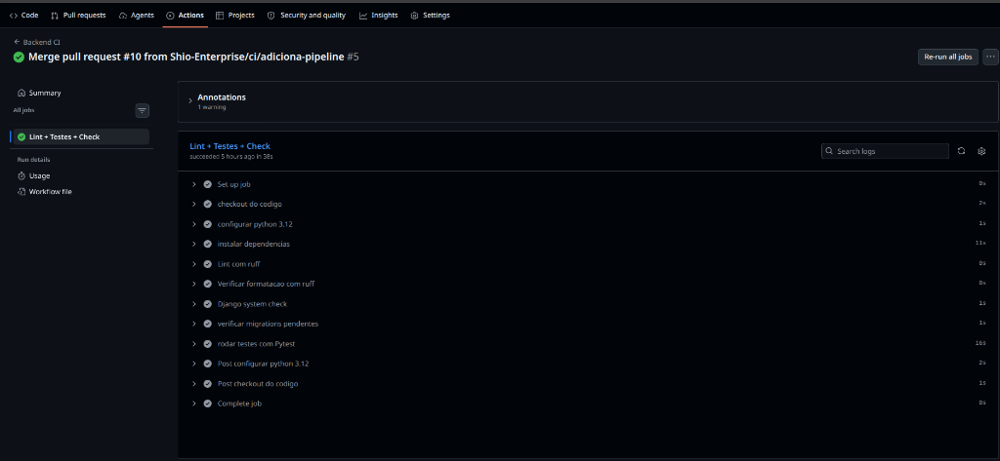
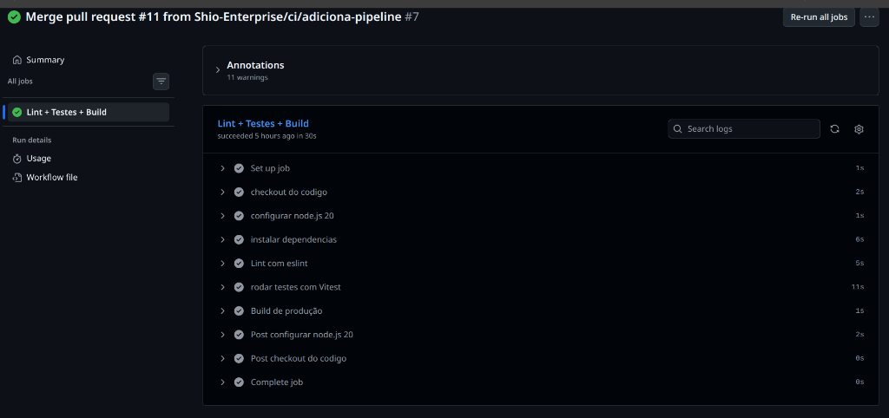
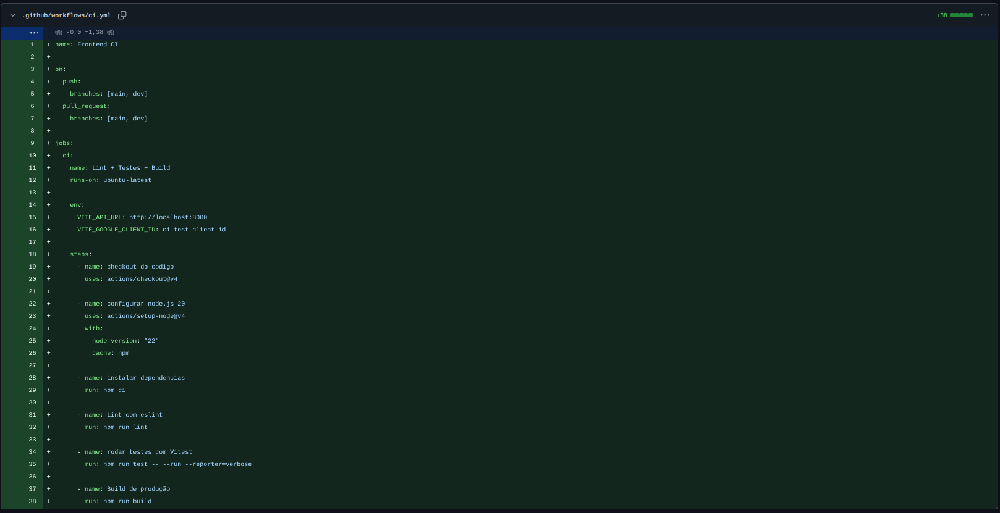
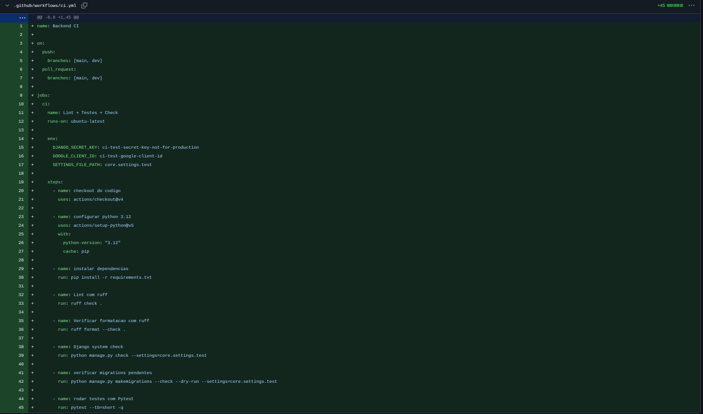

## Implementação da Pipeline de Integração Contínua (CI)
**Responsáveis:** João Ramos e João Gabriel (Squad 4)

**Origem:**
- Necessidade de padronizar o código, evitar regressões e garantir a qualidade do projeto através de verificações automatizadas de linting, testes e build.
- Iniciativa de infraestrutura transversal para proteger as branches principais (`main` e `dev`) e dar suporte seguro ao desenvolvimento contínuo das outras squads.

**Por que a melhoria foi relevante?**
Anteriormente, o projeto não possuía checagens automatizadas. Códigos com erros de sintaxe, variáveis não utilizadas (gerando dívida técnica) ou testes quebrando poderiam ser mesclados livremente no repositório. Com a pipeline de CI (Continuous Integration), o GitHub Actions passa a verificar automaticamente cada novo Pull Request e bloqueia o merge caso o código não passe nas verificações obrigatórias, aumentando significativamente a segurança, padronização e confiabilidade do ecossistema.

**Regras e Fluxos Implementados:**

- **No Frontend:**
  - Criação da pipeline `.github/workflows/ci.yml` configurada para gatilhos de `push` e `pull_request` nas branches `main` e `dev`.
  - **Linting (ESLint):** Execução do comando `npm run lint`. Foram aplicadas refatorações no código legado (remoção de variáveis ociosas em contextos e páginas) para garantir conformidade estrita ou via `warn` nas regras do projeto.
  - **Testes (Vitest):** Execução automatizada da suíte de testes com `npm run test -- --run`.
  - **Build:** Validação do empacotamento de produção (`npm run build`) para garantir que dependências ou erros de sintaxe não quebrem o deploy final.

- **No Backend:**
  - Criação da pipeline `.github/workflows/ci.yml` com os mesmos gatilhos para `main` e `dev`.
  - **Lint e Formatação (Ruff):** Adoção do linter ultrarrápido Ruff. A pipeline exige que o código passe no `ruff check .` e siga o padrão de código verificado por `ruff format --check .`. Para viabilizar a entrada da CI, toda a base de código do backend passou por um commit de formatação (The Big Bang Commit), resolvendo centenas de inconsistências (como ordenação de imports e padronização de aspas/quebras de linha).
  - **Validação do Django:** Execução de `python manage.py check` para identificar problemas sistêmicos no framework.
  - **Verificação de Migrations Pendentes:** Execução de `python manage.py makemigrations --check --dry-run` para evitar que desenvolvedores esqueçam de comitar arquivos de migração necessários para o banco de dados.
  - **Testes (Pytest):** Execução automatizada de toda a suíte de testes (`pytest --tb=short -q`).

**Evidências Visuais:**

Abaixo estão os registros das pipelines de CI configuradas e rodando com sucesso no GitHub Actions:

*Pipeline do Backend executando todas as verificações com sucesso.*

*Pipeline do Frontend executando Linting, Testes e Build de Produção.*

*Modificações aplicadas para suportar as triggers da CI no repositório do Frontend.*

*Modificações aplicadas para suportar as triggers da CI no repositório do Backend.*

