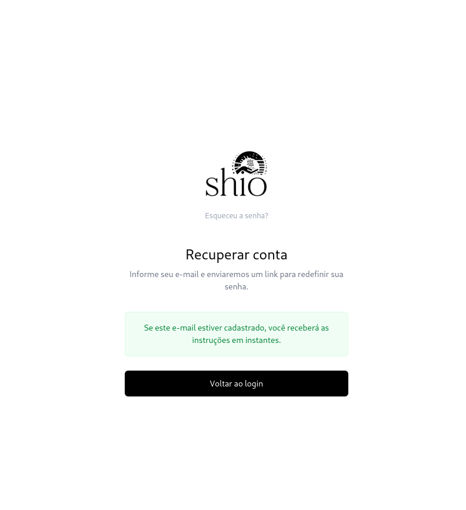
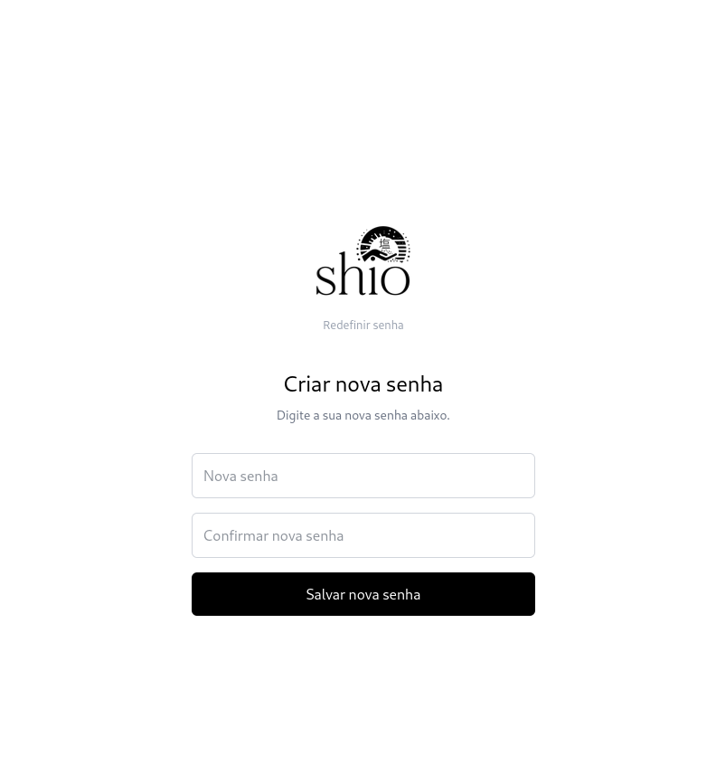

# Backlog da Sprint 2

## Visão Geral

Este documento consolida os itens da **Sprint 2** presentes no quadro Kanban do projeto **Shio**, registrando cada atividade.

---

## Avaliações de produto com compra verificada

**Issue:** [#33 — [Feature] Avaliações de produto com compra verificada](https://github.com/Shio-Enterprise/Documentacao/issues/33)  
**Responsáveis:** [Danilo Naves](https://github.com/DaniloNavesS), [Ian Costa](https://github.com/iancostag), [Arthur Sousa](https://github.com/Tutzs)  
**Sprint:** Sprint 2  
**Tipo:** Nova funcionalidade  
**Prioridade:** P2  
**Escopo:** Frontend e Backend  
**Status no quadro:** Done  

### Descrição

A loja não possuía avaliações de produto — as estrelas fixas foram removidas na O9 por não terem suporte real. A atividade permite que clientes que compraram e receberam um produto o avaliem, gerando prova social verdadeira na loja e feedback de caimento e qualidade para a marca.

### Regras

- Só pode avaliar quem comprou e recebeu o produto; quem devolveu depois de receber também pode avaliar.
- Uma avaliação por cliente por produto, que pode ser editada ou excluída.
- Nota inteira de 1 a 5 obrigatória; comentário e caimento (pequeno / certo / grande) opcionais.
- A avaliação aparece na loja assim que é enviada (moderação posterior).
- O administrador pode remover (escolhendo o motivo) e responder. O cliente vê que a avaliação foi removida e por quê, e pode editá-la para republicar.
- A avaliação mostra o nome completo do autor e o tamanho comprado.

### Critérios de Aceitação

- Cliente avalia um produto entregue a partir de "Meus pedidos".
- Cliente sem compra entregue não consegue avaliar.
- Página do produto mostra média, quantidade, comentários publicados e resumo de caimento.
- Card do produto mostra estrelas apenas quando houver avaliações.
- Administrador remove (com motivo) e responde avaliações pelo painel.
- Catálogo permite ordenar por melhor avaliação.

#### Testes

- Bloquear avaliação de quem não recebeu o produto.
- Impedir avaliação duplicada.
- Garantir que avaliações removidas não aparecem nem contam na média.
- Validar o cálculo da média.
- Garantir que apenas o administrador remove e responde.

---

## Envio de e-mails transacionais

**Issue:** [#35 — [Infra] Configurar envio de e-mails via SMTP](https://github.com/Shio-Enterprise/Documentacao/issues/35)  
**Responsáveis:** [Danilo Naves](https://github.com/DaniloNavesS), [Ian Costa](https://github.com/iancostag), [Arthur Sousa](https://github.com/Tutzs)  
**Sprint:** Sprint 2  
**Tipo:** Infraestrutura  
**Prioridade:** P1  
**Escopo:** Backend  
**Status no quadro:** Todo  

### Descrição

O sistema não enviava nenhum e-mail, deixando incompletas funcionalidades que dependem de comunicação com o cliente: a newsletter apenas armazena inscritos, não há confirmação de pedido e a recuperação de senha (#34) não podia ser implementada. A atividade cria a base de envio de e-mails, reutilizada por todas essas funcionalidades.

Como o plano Hobby do Railway bloqueia conexões SMTP, o envio foi implementado com o **Resend** via API HTTPS. Sem a chave do Resend configurada, os e-mails são exibidos no console e o deploy não é interrompido.

### Critérios de Aceitação

- Backend envia e-mails em produção usando as variáveis de ambiente configuradas.
- Ambiente local e testes não disparam e-mails reais.
- Existe um template base reutilizável (cabeçalho, rodapé e estilo da marca) em HTML e texto.
- Existe uma forma única no código de enviar e-mail, usada por todas as funcionalidades.
- Falhas de envio são registradas em log sem interromper o fluxo principal.
- Variáveis necessárias estão documentadas no README e no `.env` de exemplo.
- Envio validado em produção com um e-mail de teste.

#### Testes

- Envio de e-mail gera mensagem com destinatário, assunto, HTML e texto corretos.
- Falha simulada do provedor não gera erro para o usuário e é registrada em log.
- Ambiente de testes não realiza envio real.

---

## Recuperação de senha por e-mail

### Recuperação de senha — visão geral

**Issue:** [#34 — [Feature] Recuperação de senha por e-mail](https://github.com/Shio-Enterprise/Documentacao/issues/34)  
**Responsáveis:** [Danilo Naves](https://github.com/DaniloNavesS), [Ian Costa](https://github.com/iancostag), [Arthur Sousa](https://github.com/Tutzs)  
**Sprint:** Sprint 2  
**Tipo:** Nova funcionalidade e segurança  
**Prioridade:** P2  
**Escopo:** Frontend e Backend  
**Status no quadro:** Todo  

### Descrição

A plataforma permite cadastro e login com e-mail e senha, mas não existia forma de recuperar a senha. Um cliente que esquece a senha fica sem acesso à conta — ao histórico de pedidos, endereços e rastreamento. A recuperação de senha está prevista no backlog (US23) e depende do envio de e-mails (#35).

### Regras

- O cliente solicita a recuperação informando o e-mail na tela de login ("Esqueci minha senha").
- Se o e-mail estiver cadastrado, é enviado um link para redefinir a senha.
- A resposta na tela é sempre a mesma, exista ou não a conta.
- O link expira e só pode ser usado uma vez.
- A nova senha segue as mesmas regras de validação do cadastro.
- Após redefinir, sessões anteriores são encerradas e o cliente é avisado por e-mail.
- Limite de solicitações por e-mail/IP para evitar abuso.

### Critérios de Aceitação

- Tela de login exibe o link "Esqueci minha senha".
- Cliente recebe e-mail com link de redefinição ao informar um e-mail cadastrado.
- Mensagem exibida é idêntica para e-mail cadastrado e não cadastrado.
- Link expirado ou já utilizado mostra mensagem clara e permite solicitar um novo.
- Cliente consegue definir nova senha e fazer login com ela.
- Senha antiga deixa de funcionar e sessões anteriores são encerradas.
- Cliente recebe e-mail confirmando a alteração da senha.

### Backend — fluxo de redefinição de senha

**Issue:** [#39 — [Backend] Implementar fluxo de Redefinição de Senha (Reset Password)](https://github.com/Shio-Enterprise/Documentacao/issues/39)  
**Responsável:** [Ian Costa](https://github.com/iancostag)  
**Sprint:** Sprint 2  
**Escopo:** Backend  
**Status no quadro:** In progress  

- `POST /api/auth/password-reset/`: recebe o e-mail, gera um token específico para redefinição e envia o link de recuperação usando o app `notifications`.
- `POST /api/auth/password-reset-confirm/`: recebe o token e a nova senha, valida e atualiza a senha do usuário.

### Frontend — telas de Esqueci a Senha e Redefinir Senha

**Issue:** [#40 — [Frontend] Criar telas de Esqueci a Senha e Redefinir Senha](https://github.com/Shio-Enterprise/Documentacao/issues/40)  
**Responsável:** [Ian Costa](https://github.com/iancostag)  
**Sprint:** Sprint 2  
**Escopo:** Frontend  
**Status no quadro:** In progress  

- Tela para o usuário informar seu e-mail.
- Tela para informar a nova senha.

**Evidências (prints):**

- Integração com os novos endpoints do backend.

---

## O10 — Segurança das integrações externas

### O10.1 — Definir segurança e experiência das integrações externas

**Issue:** [#14 — O10: Definir segurança e experiência das integrações externas](https://github.com/Shio-Enterprise/Documentacao/issues/14)  
**Responsáveis:** [Matheus de Alcântara](https://github.com/matheusdealcantara), [Vilmar Fagundes](https://github.com/VilmarFagundes)  
**Sprint:** Sprint 2  
**Tipo:** Decisão de segurança e operação  
**Escopo:** Frontend e Backend  
**Status no quadro:** Todo  

### Descrição

O inventário legado é público, `CORREIOS_API_BASE_URL` está configurado mas não é utilizado, CEP e agências são públicos e o frete aceita origem, peso e serviço enviados pelo cliente. A atividade registra as decisões de throttling, cache compartilhado, TLS, bootstrap, observabilidade e experiência do frontend que orientam a implementação da #15.

### Critérios de Aceitação

- Definir que `/api/catalog/inventory/` exige administrador e documentar respostas `401` e `403`.
- Registrar taxas de throttling para CEP, agências e frete, incluindo janela, limite e resposta `429`.
- Escolher a fonte de peso dos produtos e definir CEP de origem e serviços permitidos no servidor.
- Escolher o contrato autoritativo de frete e definir quando uma cotação expira.
- Definir credenciais por ambiente, cache compartilhado, TLS do PostgreSQL e bootstrap do primeiro administrador.
- Definir campos dos logs estruturados, regras de mascaramento de dados sensíveis, métricas e alertas.
- Definir mensagens e ações do frontend para `400`, `429` e `503` e o bloqueio do checkout sem cotação válida.

### O10.2 — Endurecer integrações, checkout e observabilidade

**Issue:** [#15 — O10: [Security] Endurecer integrações, checkout e observabilidade](https://github.com/Shio-Enterprise/Documentacao/issues/15)  
**Responsáveis:** [Matheus de Alcântara](https://github.com/matheusdealcantara), [Vilmar Fagundes](https://github.com/VilmarFagundes)  
**Sprint:** Sprint 2  
**Tipo:** Segurança  
**Escopo:** Frontend e Backend  
**Status no quadro:** Todo  

### Descrição

Implementação das decisões registradas na #14: proteção administrativa do inventário, URLs dos Correios configuráveis, cotação de frete autoritativa, throttling, cache compartilhado, TLS no PostgreSQL de produção, logs estruturados e sanitizados, além do tratamento de cotação no frontend.

### Critérios de Aceitação

- Proteger `/api/catalog/inventory/` com `401` para anônimo, `403` para cliente e `200` para administrador.
- Construir todos os endpoints dos Correios a partir de `CORREIOS_API_BASE_URL`, preservando o modo mock.
- Remover `cep_origem`, `peso` e `codigo_servico` dos parâmetros públicos de frete.
- Fazer o checkout ignorar `shipping_cost` enviado pelo cliente e nunca resultar em frete zero por ausência de cotação.
- Configurar throttling, cache compartilhado, `sslmode=require` e bootstrap explícito do administrador.
- Emitir logs estruturados com `correlation_id` e mascarar dados sensíveis.
- No frontend, bloquear o checkout sem cotação válida e tratar `429` e `503`.

#### Testes

- Cobrir autorização do inventário, hosts configuráveis, mock e parâmetros logísticos rejeitados.
- Comprovar que adulterar o frete ou reutilizar cotação expirada não altera o total.
- Cobrir throttling, cache compartilhado, TLS e sanitização de logs.
- Cobrir no frontend alteração de carrinho/endereço, bloqueio de checkout, `429` e `503`.

---

## Favoritos de produtos com lista em Minha conta

**Issue:** [#37 — Favoritos de produtos com lista em Minha conta](https://github.com/Shio-Enterprise/Documentacao/issues/37)

**Responsáveis:** [Matheus de Alcântara](https://github.com/matheusdealcantara), [Vilmar Fagundes](https://github.com/VilmarFagundes)

**Sprint:** Sprint 2

**Tipo:** Nova funcionalidade

**Prioridade:** P2

**Escopo:** Frontend e Backend

**Status no quadro:** Done

### Descrição

A loja não permitia salvar produtos para consultar depois. A funcionalidade permite que clientes autenticados marquem produtos pelo coração dos cards e os reencontrem em uma lista privada na área Minha conta, preservada entre sessões.

### Regras

- Cada favorito vincula um usuário autenticado a um produto, sem reservar estoque nem fixar preço, tamanho ou cor.
- A inclusão e a remoção são idempotentes e afetam apenas a lista do usuário autenticado.
- Visitantes que acionam o coração são encaminhados ao login e retornam à página de origem.
- Produtos sem estoque permanecem na lista com indicação de indisponibilidade.
- Produtos inativos ou associados a drops privados deixam de ser exibidos, sem apagar o vínculo salvo.
- A lista usa os dados atuais do produto e oferece paginação, remoção, recuperação de erro e estado vazio.

### Critérios de Aceitação

- Exibir um coração nos cards de produto para adicionar ou remover favoritos.
- Exigir autenticação e manter os favoritos vinculados à conta após logout e novo login.
- Disponibilizar a página Meus favoritos na navegação de Minha conta em desktop e mobile.
- Listar os produtos favoritos com paginação e permitir sua remoção pela interface.
- Informar quando um produto favorito estiver indisponível, sem removê-lo automaticamente.
- Apresentar estados de carregamento, erro com nova tentativa e lista vazia.
- Impedir que dados ou respostas assíncronas de uma sessão anterior apareçam para outra conta.

#### Testes

- Validar unicidade e isolamento dos favoritos entre usuários.
- Cobrir inclusão, repetição da inclusão, remoção e repetição da remoção.
- Verificar autenticação, visibilidade dos produtos e persistência entre sessões.
- Testar o estado compartilhado dos corações, a paginação e os estados de erro e lista vazia.
- Validar o fluxo integrado no navegador com API real e PostgreSQL.

**Documentação e evidências:** [registro técnico](./squad_1/favoritos.md) e [evidências visuais](./squad_1/favoritos-evidencias.md).

---

## Métricas de comportamento dos usuários no site

**Issue:** [#38 — [Feature] Métricas de comportamento dos usuários no site (visão geral e individual)](https://github.com/Shio-Enterprise/Documentacao/issues/38)  
**Responsáveis:** [Matheus de Alcântara](https://github.com/matheusdealcantara), [Vilmar Fagundes](https://github.com/VilmarFagundes)  
**Sprint:** Sprint 2  
**Tipo:** Nova funcionalidade  
**Escopo:** Frontend e Backend  
**Estimativa:** 1  
**Status no quadro:** In progress  

### Descrição

Como administrador, acompanhar o comportamento dos usuários no site, em visão geral (agregada) e individual (por usuário), para entender o caminho até a compra e identificar onde os visitantes desistem. A funcionalidade será uma nova seção do dashboard administrativo.

### Dados coletados

- `page_view`, `product_view`, `add_to_cart`, `remove_from_cart` e `checkout_started`.
- `purchase`, reaproveitando os pedidos já existentes.
- Cada evento registra o momento (fuso America/Sao_Paulo) e, quando houver, o usuário autenticado; visitantes sem login recebem um identificador anônimo de sessão.

### Critérios de Aceitação

#### Visão geral

- Quantidade de visitantes e de usuários identificados no período.
- Páginas e produtos mais visualizados.
- Funil de conversão: visita → produto → carrinho → checkout → compra, com a taxa entre as etapas.
- Períodos iguais aos da O7: Mensal (30 dias) e Anual (agrupamento mensal).

#### Visão individual

- Primeira e última visita.
- Linha do tempo de eventos paginada, do mais recente para o mais antigo.
- Produtos visualizados e itens que foram ao carrinho e não foram comprados.
- Link para o perfil do cliente no CRM (O7).

#### Coleta e privacidade

- Envio assíncrono dos eventos, sem travar a navegação em caso de falha.
- Endpoints de leitura restritos a administradores.
- Coleta dependente de consentimento, apenas com os dados necessários e com prazo de retenção definido.

---

## Unificar autenticação e acesso ao painel administrativo

**Issue:** [#41 — [Feature] Unificar autenticação e acesso ao painel administrativo](https://github.com/Shio-Enterprise/Documentacao/issues/41)  
**Responsáveis:** [Cauã Araujo](https://github.com/caua08), [Felipe Motta](https://github.com/M0tt1nh4), [Amanda Cruz](https://github.com/mandicrz)  
**Sprint:** Sprint 2  
**Tipo:** Funcionalidade, UX e arquitetura  
**Prioridade:** P1  
**Escopo:** Frontend e Backend  
**Status no quadro:** Done

### Descrição

O acesso ao painel administrativo utiliza um fluxo separado da autenticação principal, gerando duplicidade de login e navegação pouco integrada entre a loja e a área administrativa. A aplicação deve possuir uma única rota de login para clientes e administradores, com acesso ao painel exibido apenas para contas administrativas na mesma sessão.

### Critérios de Aceitação

- Utilizar uma única rota e interface de login para usuários comuns e administradores.
- Remover o fluxo de autenticação exclusivo do painel administrativo.
- Exibir o acesso ao painel somente para usuários com permissão administrativa, identificada pelo backend.
- Impedir acesso direto às rotas administrativas por usuários sem privilégio e validar a autorização nos endpoints.
- Padronizar a navegação do painel e exibir a conta autenticada com uma ação única de logout.
- Redirecionar usuários não autenticados para a tela única de login.

#### Testes

- Login de usuário comum e de administrador pela mesma rota.
- Administradores visualizam o acesso ao painel; usuários comuns não.
- Usuário comum não acessa diretamente uma rota administrativa e não autenticado é redirecionado ao login.
- Endpoints administrativos rejeitam requisições sem autorização.
- Navegação entre loja e painel mantém a mesma sessão.

---

## Gerenciamento de permissões administrativas

**Issue:** [#54 — Gerenciamento de permissões administrativas](https://github.com/Shio-Enterprise/Documentacao/issues/54)

**Responsáveis:** [Cauã Araujo](https://github.com/caua08), [Felipe Motta](https://github.com/M0tt1nh4), [Amanda Cruz](https://github.com/mandicrz)

**Sprint:** Sprint 2
**Tipo:** Funcionalidade, segurança e arquitetura
**Prioridade:** P1
**Escopo:** Frontend e Backend
**Status no quadro:** Done

### Descrição

O painel administrativo diferenciava apenas usuários comuns e administradores, sem controlar quais áreas cada administrador poderia utilizar. A atividade adiciona permissões por domínio funcional, uma interface própria para gerenciá-las e validação efetiva dessas permissões tanto no frontend quanto no backend.

### Critérios de Aceitação

- Criar uma seção administrativa para listar e gerenciar contas com privilégios de administrador.
- Permitir visualizar e alterar as permissões administrativas de uma conta.
- Disponibilizar permissões separadas para Dashboard, Produtos e Estoque, Drops, Pedidos, Clientes e Gerenciamento de Permissões.
- Retornar as permissões administrativas da conta autenticada nas respostas de autenticação e consulta de perfil.
- Exibir na navegação administrativa somente as áreas para as quais a conta possui permissão.
- Impedir pelo backend o acesso a endpoints administrativos quando a conta não possuir a permissão correspondente.
- Manter superusuários com acesso irrestrito às funcionalidades administrativas.
- Impedir a alteração das permissões de superusuários pela interface de gerenciamento.
- Impedir que um administrador remova de si próprio a permissão necessária para gerenciar permissões administrativas.
- Garantir que administradores já existentes mantenham acesso às funcionalidades após a criação do novo modelo de permissões.
- Conceder inicialmente todas as permissões administrativas quando uma nova conta for promovida a administrador, permitindo restrições posteriores.
- Retornar `403` quando um administrador autenticado tentar acessar uma funcionalidade para a qual não possui permissão.

#### Testes

- Confirmar que apenas administradores com permissão de gerenciamento conseguem acessar a seção de permissões.
- Testar a listagem de contas administrativas.
- Testar a consulta das permissões de um administrador.
- Testar a alteração das permissões de um administrador.
- Confirmar que as permissões retornadas no login correspondem às permissões atribuídas à conta.
- Confirmar que uma área sem permissão não aparece na navegação administrativa.
- Confirmar que um administrador sem permissão recebe `403` ao acessar diretamente o endpoint correspondente.
- Confirmar que um administrador com a permissão correspondente consegue acessar a funcionalidade normalmente.
- Confirmar que superusuários possuem acesso a todas as áreas.
- Confirmar que as permissões de um superusuário não podem ser alteradas pelo gerenciamento administrativo.
- Confirmar que um administrador não consegue remover de si próprio a permissão de gerenciamento de permissões.
- Confirmar que administradores existentes recebem as permissões necessárias após a migration.

---

## Dashboard administrativo detalhado com métricas comerciais e operacionais

**Issue:** [#52 — Adicionar dashboard administrativo detalhado com métricas comerciais e operacionais](https://github.com/Shio-Enterprise/Documentacao/issues/52)

**Responsáveis:** [Cauã Araujo](https://github.com/caua08), [Felipe Motta](https://github.com/M0tt1nh4), [Amanda Cruz](https://github.com/mandicrz)

**Sprint:** Sprint 2
**Tipo:** Nova funcionalidade, UX e dados
**Prioridade:** P2
**Escopo:** Frontend e Backend
**Status no quadro:** DoD

### Descrição

O dashboard atual continua como visão rápida da loja e passa a oferecer acesso a uma página administrativa de análise detalhada. A nova página reúne indicadores financeiros, vendas ao longo do tempo, rankings de produtos, receita por drop e categoria, distribuição de pedidos, clientes e estoque. As agregações são calculadas no backend com as regras comerciais já utilizadas pelo painel.

### Regras

- As rotas do frontend e os endpoints da API são restritos a administradores.
- Venda válida exige pedido entregue e pagamento confirmado; reembolsos são subtraídos da receita bruta para formar a receita líquida.
- Períodos de 30 dias e 365 dias, além de datas personalizadas, usam o horário de São Paulo. A série pode ser vista em barras ou lista, com ordenação dos períodos.
- Rankings e receita por drop/categoria vêm dos itens de vendas válidas. A receita de itens soma quantidade × preço unitário, sem rateio de frete ou desconto.
- Pedidos por status usam a data de criação e incluem pedidos sem pagamento; indicadores financeiros e de pagamento usam a data do pagamento.
- Filtros de drop e categoria combinados correspondem ao mesmo item do pedido; totais de cadastro e estoque seguem seus critérios próprios.
- O detalhamento dos pedidos associados a métricas e agrupamentos é paginado. A página trata carregamento, ausência de dados e erro.

### Critérios de Aceitação

- Preservar o dashboard resumido e oferecer acesso à análise detalhada protegida.
- Exibir receita bruta, reembolsos, receita líquida, ticket médio, vendas válidas e sua evolução temporal.
- Exibir rankings de produtos por unidades e receita, receita por drop/categoria, pedidos por status e vendas por método de pagamento.
- Exibir clientes cadastrados, novos clientes, recorrentes, variações com estoque baixo e esgotadas.
- Aplicar filtros de período, drop e categoria de forma consistente nos indicadores aos quais se aplicam.
- Permitir abrir os pedidos relacionados aos indicadores cabíveis, sem usar dados de navegação dos usuários.
- Documentar os cálculos e parâmetros na API; manter a interface responsiva e os estados de carregamento, vazio e erro.

#### Testes

- Validar receitas, reembolsos, ticket médio, vendas válidas e série temporal, incluindo períodos sem dados.
- Validar rankings, receita por drop/categoria, status, pagamento, clientes e estoque.
- Cobrir filtros isolados e combinados, pedidos inválidos ou reembolsados, permissão administrativa e correspondência entre agregados e pedidos detalhados.
- No frontend, validar navegação entre resumo e detalhe, filtros, visualizações, detalhamento, estados de carregamento/vazio/erro e ausência de regressão no resumo.

---

## Expiração automática da reserva de estoque

**Issue:** [#43 — [Feature] Automatizar a expiração da reserva de estoque do checkout](https://github.com/Shio-Enterprise/Documentacao/issues/43)  
**Responsável:** [João Gabriel](https://github.com/JoaoComTil)  
**Sprint:** Sprint 2  
**Tipo:** Funcionalidade, estoque e concorrência  
**Prioridade:** P1  
**Escopo:** Backend  
**Status no quadro:** Todo  

### Descrição

Ao finalizar a compra, o estoque é reservado por 30 minutos enquanto o pagamento não é confirmado. A reserva vencida só era liberada quando alguém abria o detalhe do pedido; sem isso, o estoque ficava preso e o produto podia sumir do catálogo. A atividade libera reservas vencidas automaticamente, disparando a liberação nas próprias requisições de carrinho, checkout e catálogo, já que o projeto não usa filas de tarefas. Depende de o webhook da InfinitePay (O1, etapas 5 e 6) ser o único caminho de confirmação de pagamento.

### Critérios de Aceitação

- Liberação de reserva segura contra concorrência e idempotente, sem devolver o estoque duas vezes.
- Reservas vencidas liberadas antes de validar estoque no carrinho, na cotação e no checkout.
- Varredura periódica limitada nas rotas de catálogo e carrinho, sem cron.
- Pedido com pagamento confirmado ou dentro do prazo nunca é cancelado.
- Falha na liberação não quebra a requisição que a disparou.
- Comando `expire_stale_orders` disponível para agendamento opcional.

#### Testes

- Reserva vencida não bloqueia nova compra do mesmo item.
- Produto volta ao catálogo sem ninguém abrir o pedido antigo.
- Concorrência entre liberação e confirmação de pagamento via webhook.

---

## Cupons de desconto

### Cupons — visão geral

**Responsáveis:** [João Gabriel](https://github.com/JoaoComTil), [João Lucas Ramos](https://github.com/Joaolramos)  
**Sprint:** Sprint 2  
**Tipo:** Nova funcionalidade  
**Escopo:** Frontend e Backend  

### Descrição

Hoje só o cupom BEMVINDO10 funciona, aplicado automaticamente na primeira compra e com a regra fixa no código. A atividade permite que o cliente digite qualquer cupom no checkout e que a equipe da Shio crie e gerencie cupons pelo painel, com limite de usos total e por cliente, valor mínimo do pedido e restrição a drops ou categorias. A integração com a Méliuz depende de contato comercial e fica fora desta entrega; o campo de parceiro do cupom já permite cupons exclusivos de parceiros e influenciadores.

### Regras

- Um cupom por pedido; o código digitado substitui o desconto automático.
- O cupom vale também para itens em promoção.
- O valor mínimo é comparado com o subtotal, sem frete.
- O desconto incide só sobre os itens do escopo do cupom; o desconto fixo nunca passa do valor desses itens.
- Cupom inválido recusa a cotação com a mensagem do motivo, em vez de cotar sem desconto.
- Um uso conta apenas para pedidos não cancelados: quando o pedido é cancelado, inclusive por reserva vencida, o uso volta.
- Cupom já usado não pode ter o código alterado nem ser apagado, só desativado.

### Linha de desconto na InfinitePay

**Issue:** [#45 — [Bug] Corrigir a linha de desconto enviada à InfinitePay](https://github.com/Shio-Enterprise/Documentacao/issues/45)  
**Responsável:** [João Gabriel](https://github.com/JoaoComTil)  
**Prioridade:** P1  
**Escopo:** Backend  
**Status no quadro:** Todo  

- A linha de desconto na InfinitePay passa a mostrar o código do cupom aplicado.
- Verificação em sandbox de que a InfinitePay aceita a linha de desconto no cartão e no PIX.
- Implementada junto com a entrada do cupom no checkout, depois da confirmação de pagamento via webhook (O1, etapas 5 e 6).

### Modelo de cupom e contagem de usos

**Issue:** [#46 — [Backend] Modelo de cupom com limites, escopo e contagem de usos](https://github.com/Shio-Enterprise/Documentacao/issues/46)  
**Responsável:** [João Gabriel](https://github.com/JoaoComTil)  
**Prioridade:** P1  
**Escopo:** Backend  
**Status no quadro:** Todo  

- Novos campos do cupom: período de validade, limites de uso, valor mínimo, teto do desconto, primeira compra, aplicação automática, drops, categorias e parceiro.
- Código sem diferenciar maiúsculas e minúsculas.
- BEMVINDO10 migrado para os novos campos, sem mudar o comportamento.
- Contagem de usos derivada dos pedidos não cancelados.
- Pedido cancelado deixa de tirar o desconto de primeira compra do cliente.
- Cupom usado em pedido não pode ser apagado.

### Cupom na cotação e no checkout

**Issue:** [#47 — [Backend] Validar cupom digitado e aplicá-lo na cotação e no checkout](https://github.com/Shio-Enterprise/Documentacao/issues/47)  
**Responsável:** [João Gabriel](https://github.com/JoaoComTil)  
**Prioridade:** P1  
**Escopo:** Backend  
**Status no quadro:** Todo  

- Validação do cupom em nove verificações, cada uma com mensagem e código de erro próprios.
- Código enviado na cotação, gravado nela e revalidado com trava no checkout.
- Erro específico quando o cupom deixa de valer entre a cotação e o pagamento.
- Compras simultâneas não ultrapassam o limite de usos.

### Campo de cupom no checkout

**Issue:** [#48 — [Frontend] Campo de cupom de desconto no checkout](https://github.com/Shio-Enterprise/Documentacao/issues/48)  
**Responsável:** [João Gabriel](https://github.com/JoaoComTil)  
**Prioridade:** P1  
**Escopo:** Frontend  
**Status no quadro:** Todo  

- Campo para aplicar e remover o cupom no resumo da compra.
- Mensagem de erro embaixo do campo quando o cupom não vale.
- Linha do desconto com o código do cupom aplicado.

### CRUD de cupons no painel administrativo

**Issue:** [#49 — [Backend] CRUD de cupons no painel administrativo](https://github.com/Shio-Enterprise/Documentacao/issues/49)  
**Responsável:** [João Lucas Ramos](https://github.com/Joaolramos)  
**Prioridade:** P2  
**Escopo:** Backend  
**Status no quadro:** Todo  

- Criar, listar, editar e desativar cupons, restrito a administradores.
- Listagem com usos, usos restantes, desconto concedido e receita de cada cupom.
- Filtros por situação, busca e parceiro.
