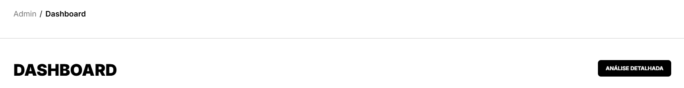
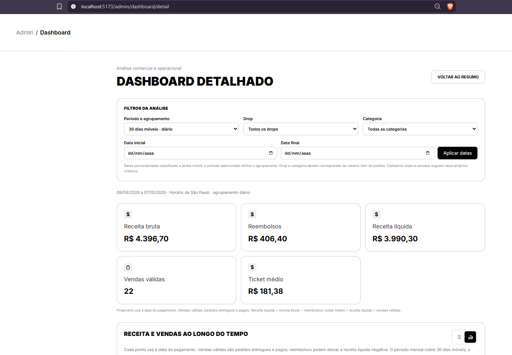
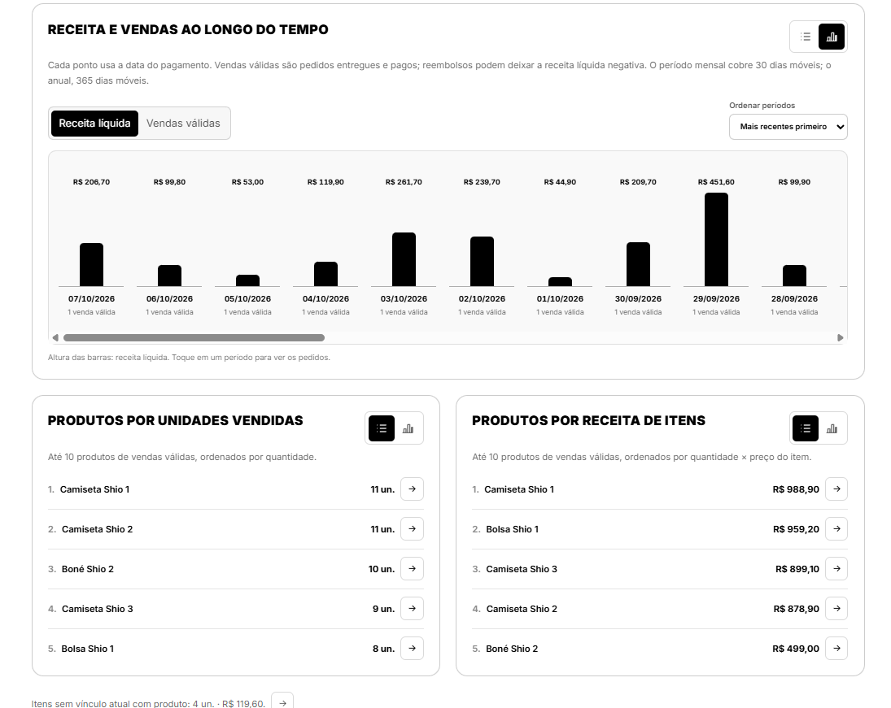
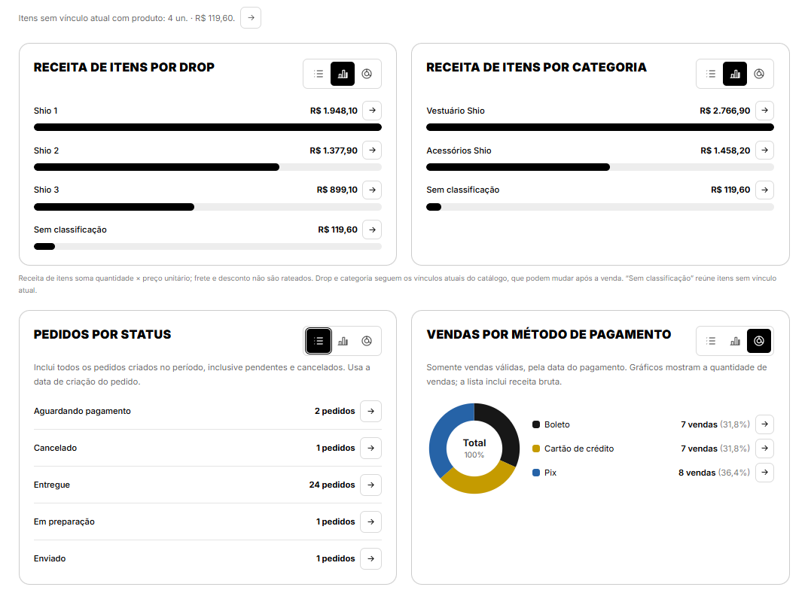
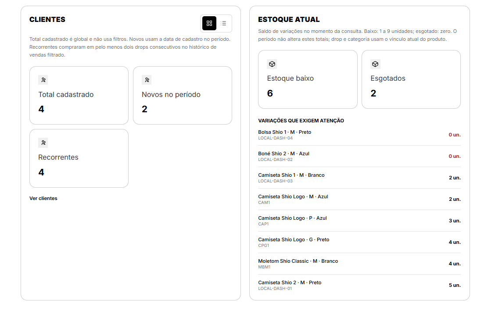
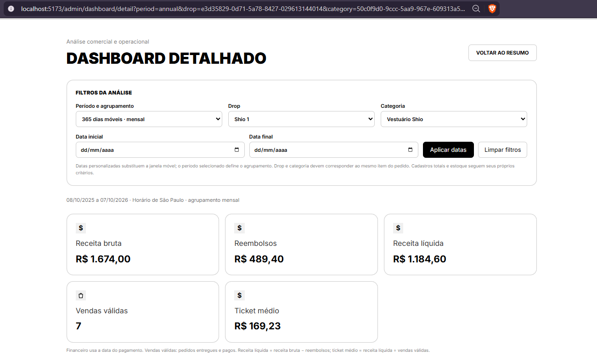
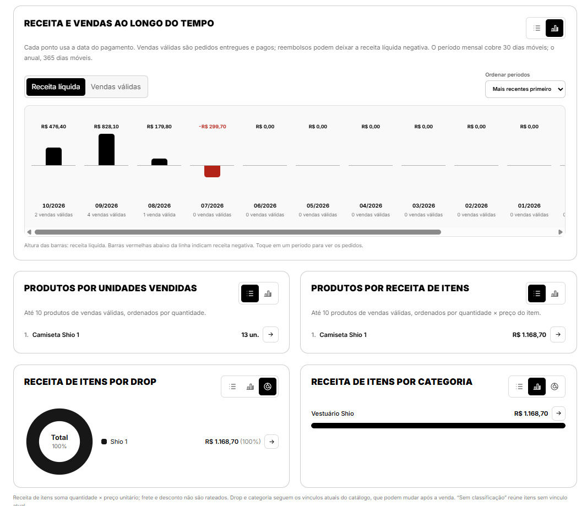
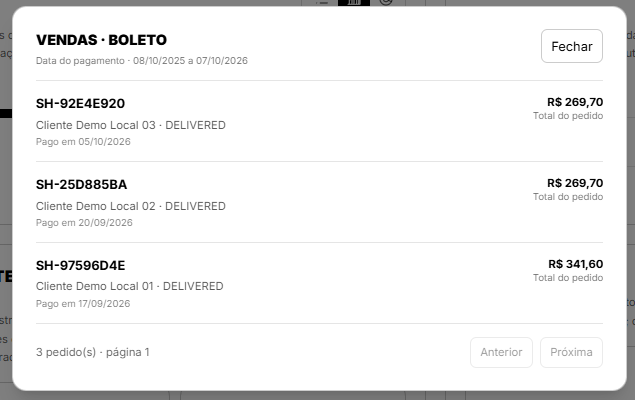

## Dashboard administrativo detalhado com métricas comerciais e operacionais

**Trio:** Amanda, Felipe e Cauã

**Origem:**
- [Issue #52](https://github.com/Shio-Enterprise/Documentacao/issues/52) - dashboard administrativo detalhado com métricas comerciais e operacionais.

**Por que a melhoria foi relevante?**
O dashboard administrativo existente oferece um resumo rápido da loja, mas não permite investigar a composição dos resultados. A nova página mantém esse resumo e reúne análises financeiras, vendas, produtos, pedidos, clientes e estoque em um mesmo lugar. Os totais são calculados no backend a partir dos registros completos, com filtros e detalhamento dos pedidos relacionados a cada indicador.

**Regras implementadas:**
- O dashboard atual foi mantido, com um botão para abrir a análise detalhada. O acesso é exclusivo para administradores.
- A página reúne receita, vendas, produtos, pedidos, clientes e estoque. Vendas válidas são pedidos entregues e pagos; reembolsos são descontados da receita.
- É possível filtrar por período, drop, categoria e datas específicas. Os gráficos também podem ser vistos como lista, e os períodos podem ser ordenados.
- Os rankings e as receitas por drop e categoria usam os itens vendidos. Ao clicar em uma métrica, o administrador pode ver os pedidos relacionados.
- Pedidos por status incluem os pendentes e cancelados; clientes e estoque seguem seus próprios critérios. A página mostra mensagens de carregamento, erro e ausência de dados.

**Evidências (Pull Requests):**
- [Backend PR #20](https://github.com/Shio-Enterprise/backend/pull/20)
- [Frontend PR #18](https://github.com/Shio-Enterprise/frontend/pull/18)

**Evidências (prints):**

Capturas feitas no ambiente local com dados fictícios para demonstração.

**Resumo e acesso à análise detalhada.** O dashboard original mantém o botão que abre a nova página:

**Dashboard detalhado.** Os prints mostram os filtros e indicadores financeiros, a evolução das vendas e os rankings, a receita por drop e categoria, pedidos por status e métodos de pagamento, e, por fim, clientes e estoque:

**Filtros e visualizações.** O período anual combinado com drop e categoria atualiza os indicadores, a série mensal, os rankings e a distribuição em rosca:

**Pedidos relacionados.** O detalhamento da métrica de vendas por boleto mostra os pedidos que compõem o resultado:

