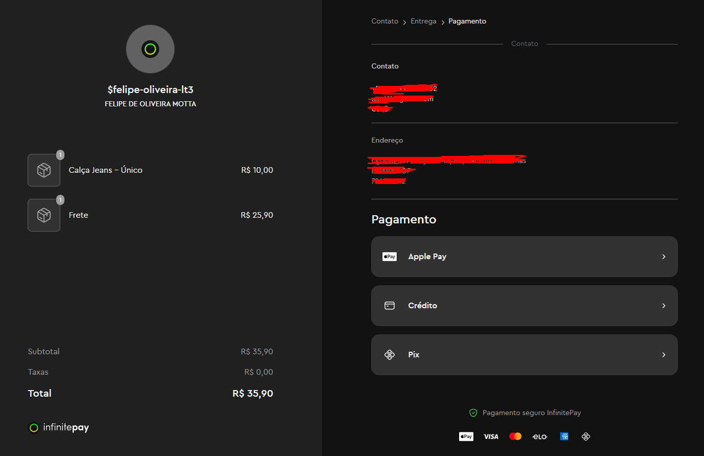
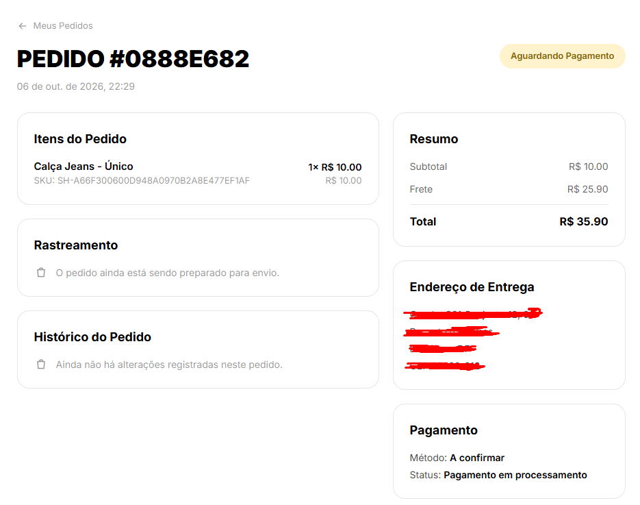
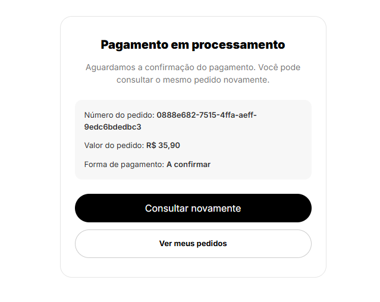
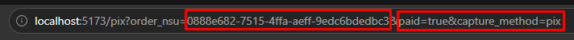
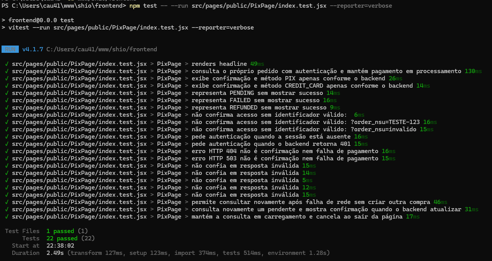

## O1: Confirmar e exibir pagamentos com segurança — Etapas 5 e 6
**Trio:** Amanda, Felipe e Cauã

**Origem:**
- [Issue #22](https://github.com/Shio-Enterprise/Documentacao/issues/22) — tornar o backend a fonte única do valor da compra.

**Por que a melhoria foi relevante?**
As etapas iniciais da O1 protegeram os valores do checkout, persistiram a cotação e impediram tentativas duplicadas, mas a conclusão do pagamento ainda precisava refletir exclusivamente o estado confirmado pela InfinitePay. As Etapas 5 e 6 completam esse fluxo: o backend recebe a notificação, consulta o provedor, valida valor, método, parcelas e identificadores antes de atualizar o pedido de forma idempotente; o redirecionamento do navegador deixa de confirmar pagamentos. No frontend, a tela de retorno consulta o pedido autenticado e só apresenta sucesso quando o backend informa `PAID`, mantendo estados pendentes, falhos ou reembolsados sem confirmação falsa. O método utilizado, o total e o desconto exibidos também passam a vir do estado registrado no servidor.

**Evidências (Pull Requests):**

- [Frontend PR #15](https://github.com/Shio-Enterprise/frontend/pull/15)
- [Backend PR #17](https://github.com/Shio-Enterprise/backend/pull/17)

**Evidências (prints):**

### Etapa 5 — Confirmação segura do pagamento no backend

A cobrança foi criada na InfinitePay com o mesmo valor calculado pelo backend, incluindo produto e frete. A página do provedor disponibiliza as formas de pagamento aceitas sem fazer o sistema registrar antecipadamente uma delas como a forma escolhida:

Enquanto não há confirmação verificada da InfinitePay, o pedido permanece como **Aguardando Pagamento**, com método **A confirmar** e status **Pagamento em processamento**. Isso evidencia que a criação da cobrança ou o redirecionamento ao provedor não marcam o pedido como pago e não o registram antecipadamente como cartão ou PIX:

### Etapa 6 — Exibição do estado real no frontend

A página de retorno consulta o pedido autenticado no backend e apresenta o estado persistido pelo servidor. Como o gateway ainda não confirmou o pagamento, a tela mantém **Pagamento em processamento**, exibe o método **A confirmar** e oferece apenas uma nova consulta ao mesmo pedido, sem mensagem de sucesso ou confirmação automática:

Mesmo com `paid=true` e `capture_method=pix` na URL, o frontend mantém o estado retornado pelo backend. Isso comprova que parâmetros do navegador não confirmam nem definem o método de pagamento:

A suíte automatizada da página de retorno concluiu os 22 testes com sucesso. Os cenários cobrem a exibição de PIX e cartão somente quando informados pelo backend, a manutenção dos estados pendente, falho e reembolsado sem falso sucesso, a exigência de autenticação e identificador válido, a rejeição de respostas inválidas e a atualização manual do estado após uma nova consulta:

