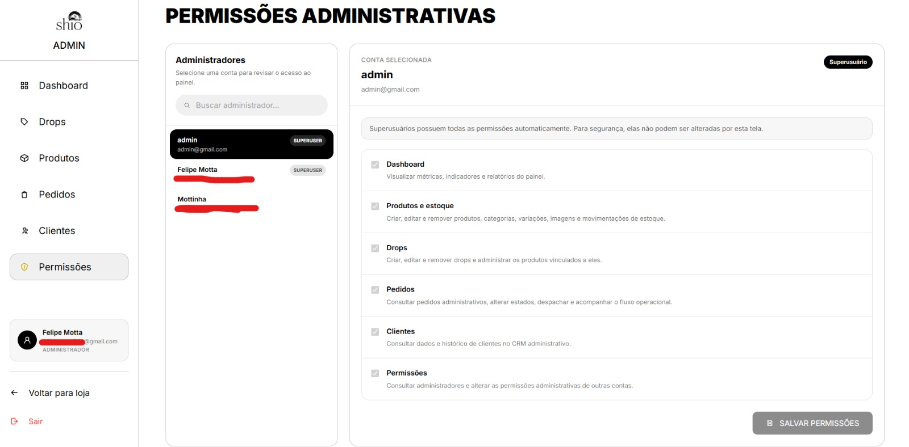

## Gerenciamento de permissões administrativas
**Trio:** Amanda, Felipe e Cauã

**Origem:**
- [Issue #54](https://github.com/Shio-Enterprise/Documentacao/issues/54) — gerenciamento de permissões dos administradores no painel.

**Por que a melhoria foi relevante?**
Antes desta entrega, o sistema diferenciava apenas contas comuns e contas administrativas. Todo administrador recebia, na prática, acesso às mesmas operações, mesmo que sua função exigisse somente uma parte do painel. A melhoria introduz permissões por domínio funcional e faz com que essas regras sejam aplicadas de ponta a ponta: na navegação, nas rotas do frontend e nos endpoints do backend.

**Permissões administrativas:**
- **Dashboard:** visualizar métricas, indicadores e relatórios administrativos.
- **Produtos e estoque:** gerenciar produtos, categorias, variações, imagens, avaliações e movimentações de estoque relacionadas ao catálogo.
- **Drops:** criar, editar, remover e administrar drops e seus produtos.
- **Pedidos:** consultar pedidos e executar o fluxo operacional administrativo.
- **Clientes:** consultar dados e histórico dos clientes no CRM.
- **Permissões:** consultar administradores e alterar as permissões administrativas de outras contas.

**Regras implementadas:**
- Foi criada a página `/admin/permissions` para listar administradores e editar suas permissões por área da aplicação.
- As permissões são registradas no mecanismo de permissões do Django e retornadas pelo backend junto aos dados da conta autenticada.
- A sidebar e as rotas administrativas exibem e permitem acesso apenas às áreas autorizadas para a conta atual.
- A autorização é validada novamente no backend; acessar diretamente um endpoint sem a permissão correspondente retorna `403`.
- Superusuários possuem todas as permissões de forma implícita e suas permissões não podem ser alteradas pela tela administrativa.
- Um administrador não pode remover de si próprio a permissão de gerenciamento de permissões, evitando bloqueio acidental da administração.
- Uma conta administrativa não pode ser salva sem nenhuma permissão funcional.
- A migration cria as permissões e atribui todas elas aos administradores já existentes, preservando o comportamento anterior após a atualização.
- Novas contas promovidas a administrador recebem inicialmente todas as permissões, que podem ser restringidas posteriormente.

**Endpoints adicionados:**
- `GET /api/auth/admins/` — lista as contas administrativas.
- `GET /api/auth/admins/permissions/` — retorna as permissões disponíveis e suas descrições.
- `PATCH /api/auth/admins/{id}/` — substitui as permissões funcionais da conta selecionada.

**Validação automatizada:**
- Testes de acesso à listagem e às opções de permissões.
- Testes de atualização das permissões de outro administrador.
- Testes de bloqueio para usuários sem a permissão de gerenciamento.
- Testes de autorização por domínio, garantindo `403` quando a permissão correspondente não está presente.
- Testes de exposição das permissões efetivas da conta autenticada.
- Testes de proteção contra alteração de superusuários e contra remoção da própria permissão de gerenciamento.
- Testes de atribuição inicial de permissões para contas administrativas.
- Testes no frontend para renderização, edição da página de permissões e filtragem das opções da navegação administrativa.

**Evidências (Pull Requests):**

- [Frontend PR #20](https://github.com/Shio-Enterprise/frontend/pull/20)
- [Backend PR #21](https://github.com/Shio-Enterprise/backend/pull/21)

**Evidências (prints):**

O painel administrativo permite visualizar e gerenciar as permissões atribuídas a cada administrador da aplicação. As permissões são organizadas por área funcional, permitindo controlar individualmente o acesso ao Dashboard, Produtos e Estoque, Drops, Pedidos, Clientes e ao próprio gerenciamento de permissões:

