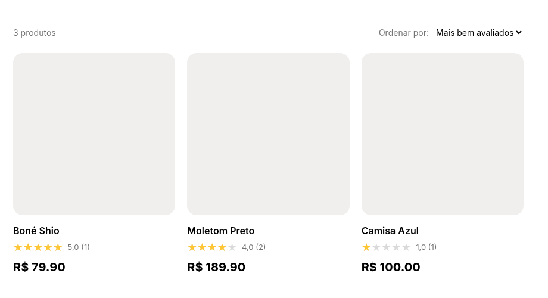
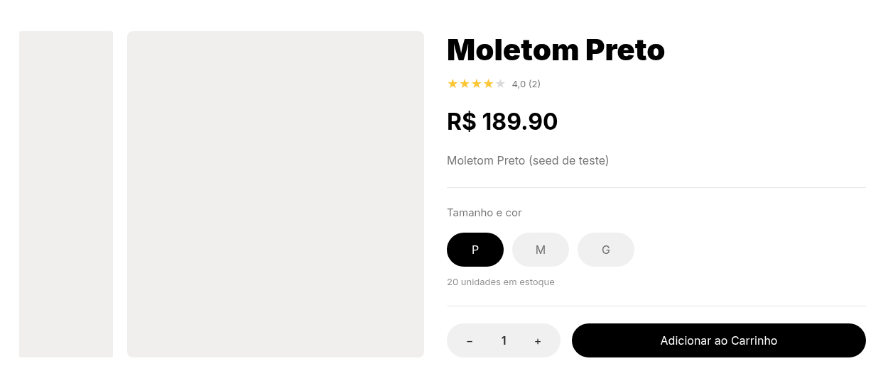
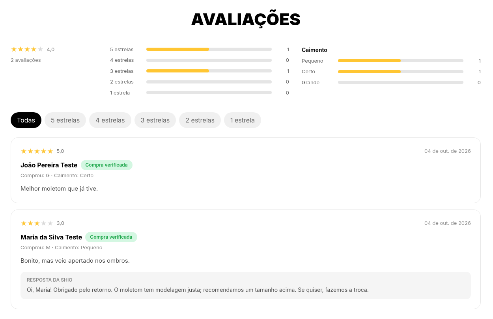
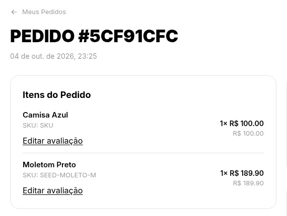
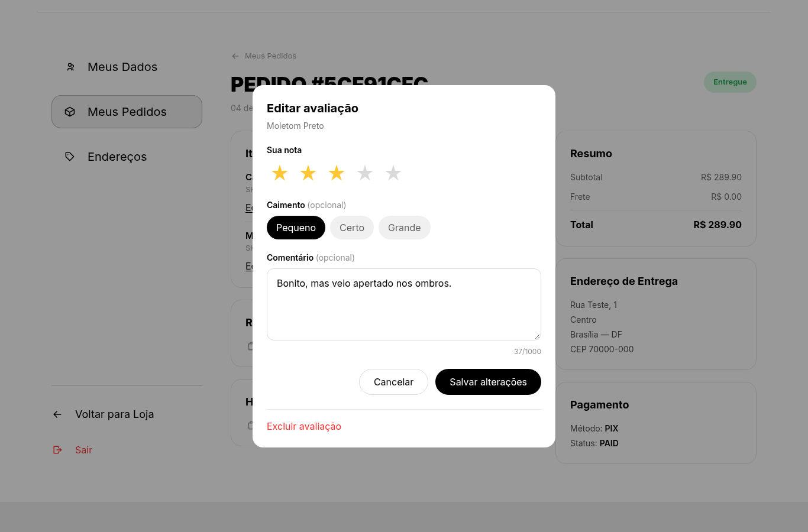
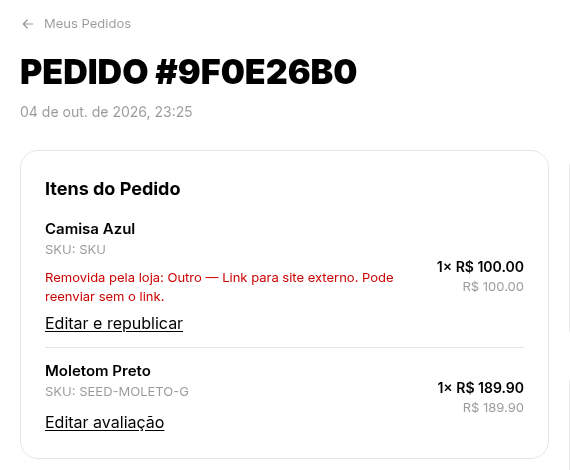
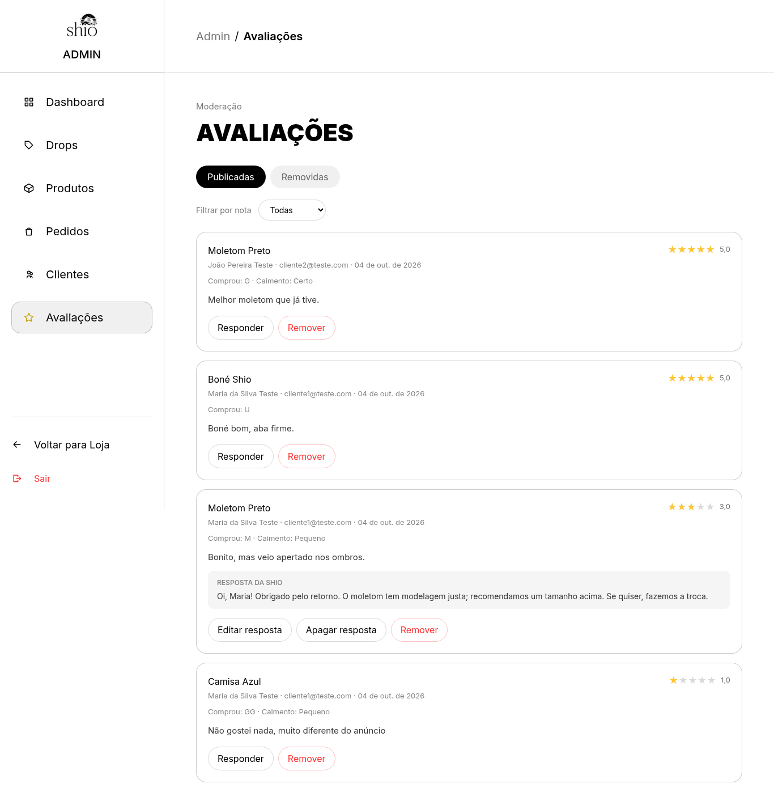
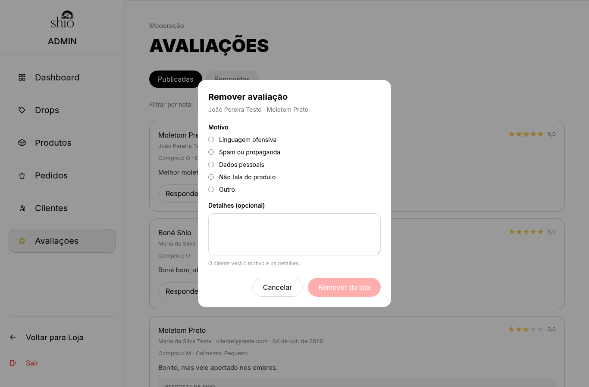
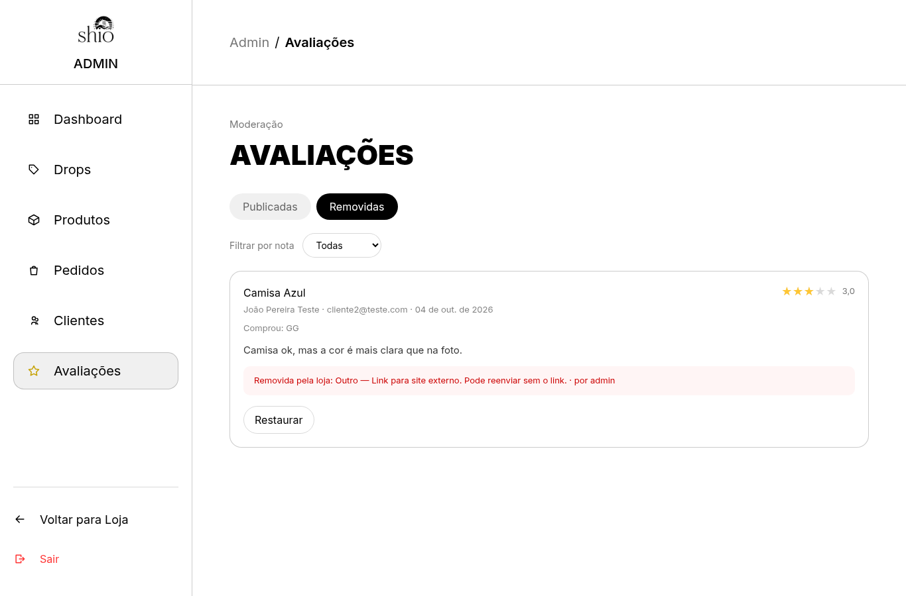

## Avaliações de produto com compra verificada
**Trio:** Ian, Arthur e Danilo

**Origem:**
- [Issue #33](https://github.com/Shio-Enterprise/Documentacao/issues/33) — avaliações de produto com compra verificada.
- Follow-up de ajustes no front: [issue #36](https://github.com/Shio-Enterprise/Documentacao/issues/36).

**Por que a melhoria foi relevante?**
As estrelas de avaliação fixas foram removidas na O9 por não terem suporte real no backend. Com esta entrega, apenas clientes que compraram e receberam o produto podem avaliá-lo, gerando prova social verdadeira na loja e feedback de caimento e qualidade para a marca.

**Regras implementadas:**
- Só avalia quem recebeu o produto; quem devolveu depois de receber também pode avaliar.
- Uma avaliação por cliente por produto, com edição e exclusão pelo autor.
- Nota de 1 a 5 obrigatória; comentário e caimento (pequeno / certo / grande) opcionais.
- Moderação posterior: a avaliação é publicada na hora e o administrador pode removê-la escolhendo o motivo (Linguagem ofensiva, Spam ou propaganda, Dados pessoais, Não fala do produto ou Outro).
- O cliente vê que a avaliação foi removida e o motivo; ao editar, ela volta a ser publicada.
- O administrador pode responder às avaliações.
- Média e quantidade de avaliações armazenadas no produto (`rating_avg` / `rating_count`), recalculadas a cada alteração; o catálogo permite ordenar por "Mais bem avaliados".
- Limite de envio de avaliações por usuário (throttle de 20 por hora).

**Evidências (Pull Requests):**
- [Backend PR #13](https://github.com/Shio-Enterprise/backend/pull/13)
- [Backend PR #14](https://github.com/Shio-Enterprise/backend/pull/14) — correção dos testes que quebravam o CI da `dev`, pré-requisito do merge
- [Frontend PR #13](https://github.com/Shio-Enterprise/frontend/pull/13)

**Validação manual:**
Fluxos testados com backend e frontend rodando localmente:
1. Cliente avalia um produto a partir do pedido entregue.
2. Administrador remove a avaliação com o motivo "Outro".
3. Cliente vê o motivo da remoção, edita e republica.
4. Administrador responde à avaliação.
5. Catálogo ordenado por "Mais bem avaliados".

**Evidências (prints):**

Catálogo ordenado por "Mais bem avaliados", com estrelas, média e quantidade de avaliações nos cards:

Página do produto com a média e a quantidade de avaliações ao lado do título:

Seção de avaliações do produto: distribuição por nota, resumo de caimento, filtro por estrelas, selo "Compra verificada", tamanho comprado e resposta da loja:

Cliente avalia a partir dos itens de um pedido entregue em "Meus pedidos":

Formulário de avaliação com nota, caimento e comentário opcionais:

Cliente vê que a avaliação foi removida pela loja, com o motivo, e pode editá-la para republicar:

Painel administrativo de moderação das avaliações publicadas, com ações de responder e remover:

Remoção pelo administrador com escolha obrigatória do motivo:

Avaliações removidas, com o motivo registrado e a opção de restaurar:

