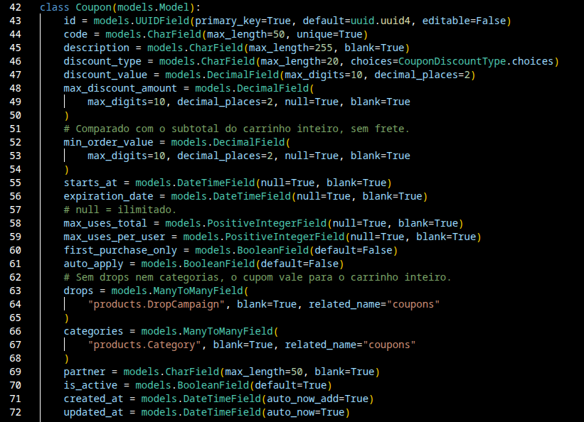
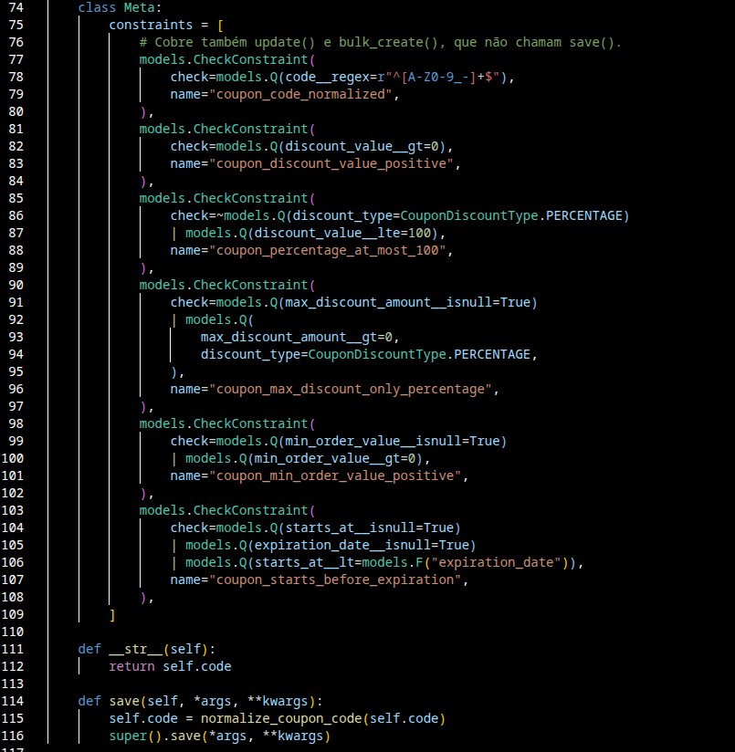
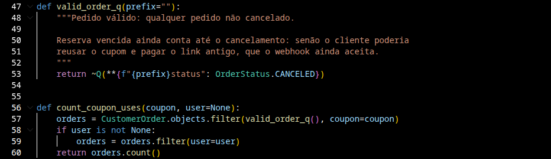
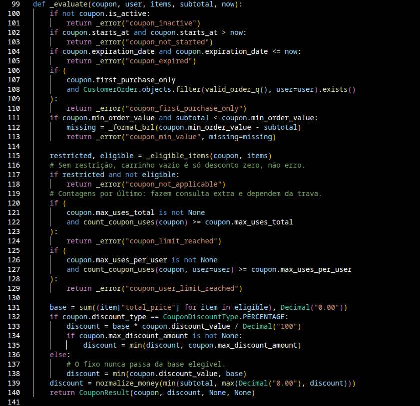
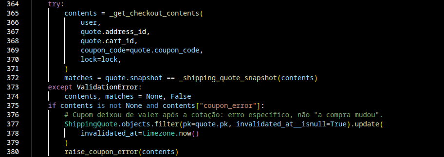
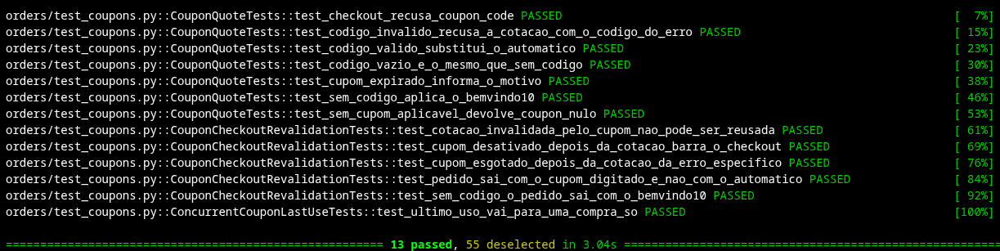
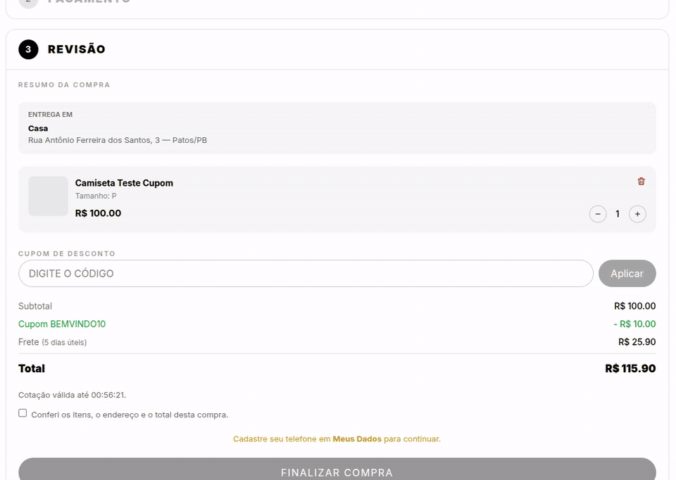

## Checkout com cupom
**Trio:** João Gabriel e João Reis

**Origem:**
- [Issue #45](https://github.com/Shio-Enterprise/Documentacao/issues/45) — corrigir a linha de desconto enviada à InfinitePay.
- [Issue #46](https://github.com/Shio-Enterprise/Documentacao/issues/46) — modelo de cupom com limites, escopo e contagem de usos.
- [Issue #47](https://github.com/Shio-Enterprise/Documentacao/issues/47) — validar o cupom digitado e aplicá-lo na cotação e no checkout.
- [Issue #48](https://github.com/Shio-Enterprise/Documentacao/issues/48) — campo de cupom de desconto no checkout (frontend).
- [Issue #49](https://github.com/Shio-Enterprise/Documentacao/issues/49) — CRUD de cupons no painel administrativo.

**Por que a melhoria foi relevante?**
Só o cupom BEMVINDO10 funcionava, aplicado automaticamente na primeira compra e com a regra fixa no código. A loja não tinha como fazer campanhas com cupom (por drop, por categoria, com limite de usos ou para parceiros como a Méliuz), e a equipe dependia de um desenvolvedor para qualquer desconto novo.

**Decisões técnicas:**
- O modelo `Coupon` existente foi estendido em vez de criar outro, porque pedido, cotação e dashboard já apontam para ele.
- O uso de um cupom é derivado dos próprios pedidos, sem contador separado: quando um pedido é cancelado, inclusive por reserva vencida, o uso volta sozinho.
- Pedido aguardando pagamento com a reserva vencida continua contando como uso até ser cancelado, para que o cliente não consiga usar o mesmo cupom de novo e depois pagar o link antigo.
- O código do cupom é guardado sempre em maiúsculas, garantido por constraint no banco, e o código digitado é normalizado antes da busca.
- O cupom digitado é validado na cotação e revalidado com trava no checkout, para que compras simultâneas não ultrapassem o limite de usos.

**Regras:**
- Um cupom por pedido; o código digitado substitui o desconto automático.
- O cupom vale também para itens em promoção.
- O valor mínimo é comparado com o subtotal, sem frete.
- O desconto incide só sobre os itens do escopo do cupom; o desconto fixo nunca passa do valor desses itens.
- Cupom inválido recusa a cotação com a mensagem do motivo.
- Cupom já usado não pode ter o código alterado nem ser apagado, só desativado.

**Evidências (Pull Requests):**
- [Backend PR #19](https://github.com/Shio-Enterprise/backend/pull/19) — modelo de cupom, contagem de usos e correção do desconto de primeira compra (#46).
- [Backend PR #23](https://github.com/Shio-Enterprise/backend/pull/23) — validação e cálculo do cupom, entrada do código na cotação e no checkout e linha de desconto na InfinitePay (#47 e #45).
- [Frontend PR #21](https://github.com/Shio-Enterprise/frontend/pull/21) — campo de cupom de desconto na tela de pagamento (#48).

**Validações registradas nos PRs:**
- Testes automatizados em `orders/test_coupons.py` para cada uma das nove verificações do cupom, para o cálculo do desconto (percentual com e sem teto, valor fixo e escopo por drop e categoria) e para o fluxo pela API (cotação com e sem cupom, código inválido, cupom desativado ou esgotado entre a cotação e o checkout).
- Disputa pelo último uso de um cupom testada com duas transações reais em Postgres: o teste falha sem a trava do cupom e passa com ela.
- Suíte completa executada no CI (SQLite) e também em Postgres (`core.settings.dev`), onde rodam os testes de concorrência.

**Pendências:**
- Validar em sandbox que a InfinitePay aceita a linha de desconto no cartão e no PIX (#45).
- CRUD de cupons no painel administrativo (#49).
- Integração com a Méliuz depende de contato comercial.

**Evidências (prints):**

### Evidências dos trechos de código do backend

**Modelo do cupom — `orders/models.py`.** O `Coupon` existente ganha período de validade, limites de uso total e por cliente, valor mínimo, teto do desconto, regras de primeira compra e aplicação automática, restrição por drops e categorias e parceiro.

**Regras garantidas pelo banco — `orders/models.py`.** Constraints impedem código fora do padrão, desconto não positivo, percentual acima de 100, teto em cupom de valor fixo e início depois da expiração, mesmo em escritas que não passam pelo `save()`.

**Uso derivado dos pedidos — `orders/coupons.py`.** Não existe contador de usos: um cupom foi usado quando há um pedido não cancelado com ele. Quando o pedido é cancelado, inclusive por reserva vencida, o uso volta sozinho.

**Validação e cálculo do desconto — `orders/coupons.py`.** As verificações seguem uma ordem fixa e a primeira que falha define o erro mostrado ao cliente; o desconto incide só sobre os itens do escopo do cupom.

**Revalidação no checkout — `orders/services.py`.** O checkout recalcula a compra com o cupom gravado na cotação e com a linha do cupom travada; se ele deixou de valer, a cotação é invalidada e o cliente recebe o motivo exato.

**Testes do fluxo e da concorrência — `orders/test_coupons.py`.** Testes da cotação, do checkout e da disputa pelo último uso de um cupom, executados em Postgres.

### Evidência do frontend

**Cupom aplicado na tela de pagamento.** O cliente digita um cupom vencido e vê o motivo embaixo do campo; em seguida aplica um cupom válido, que aparece com o código na linha de desconto e reduz o total; ao remover, volta o desconto automático de primeira compra.

