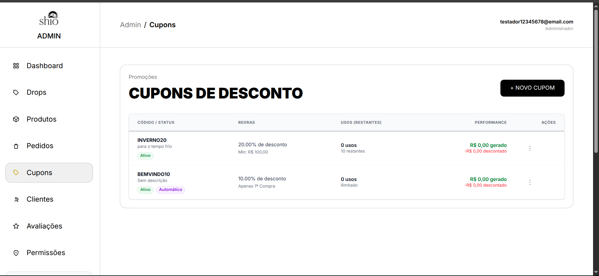
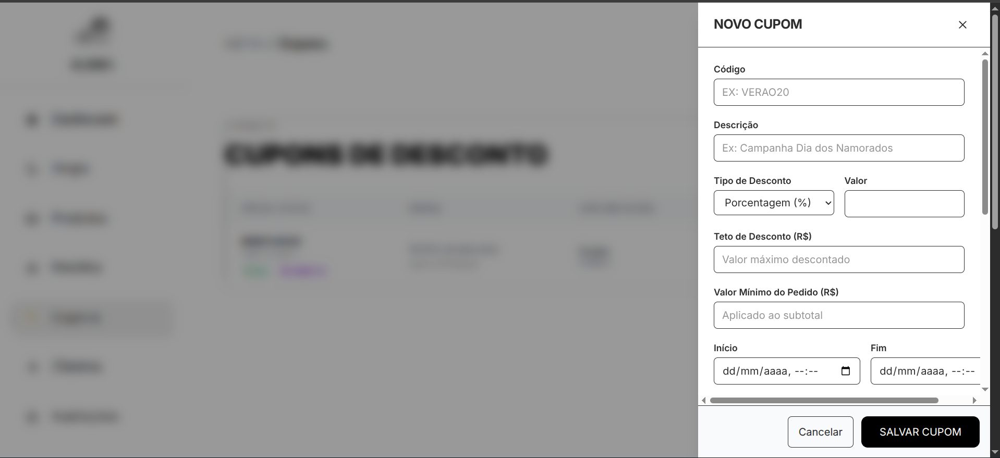
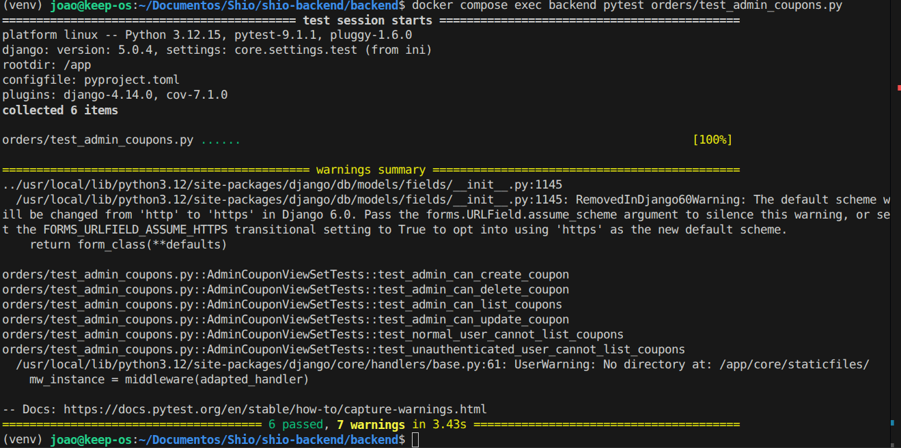
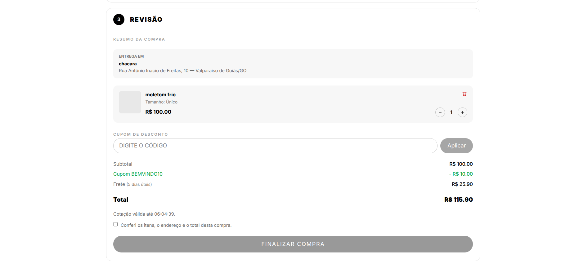
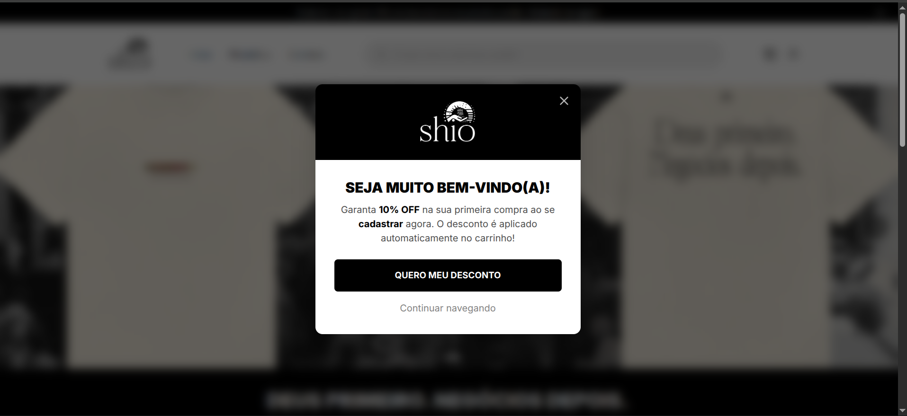

## CRUD de cupons no painel administrativo
**Trio:** João Gabriel e João Reis

**Origem:**
- [Issue #49](https://github.com/Shio-Enterprise/Documentacao/issues/49) — [Backend] CRUD de cupons no painel administrativo.
- [Issue #60](https://github.com/Shio-Enterprise/Documentacao/issues/60) — [Frontend] Página de gerenciamento de cupons no painel administrativo.
- [Issue #59](https://github.com/Shio-Enterprise/Documentacao/issues/59) — [Frontend] Modal de boas-vindas para novos clientes.

**Por que a melhoria foi relevante?**
A loja Shio não tinha nenhuma interface para a equipe criar ou gerenciar cupons de desconto: a única forma era um desenvolvedor alterar dados diretamente no banco ou pelo Django admin (que sequer registrava o modelo). Com o crescimento das campanhas promocionais e a variedade de regras (por drop, por categoria, com limite de usos, para parceiros), era inviável depender de intervenção técnica para cada cupom novo.

**Decisões técnicas:**
- A API administrativa (`/api/orders/admin/coupons/`) reutiliza o modelo `Coupon` já existente, sem duplicar entidades, para que pedidos, cotações e dashboard continuem funcionando sem ajustes.
- Métricas de uso (usos, usos restantes, desconto concedido e receita) são calculadas em uma única consulta com `annotate`, sem N+1 queries.
- Cupom já usado não pode ter o código alterado nem ser apagado — apenas desativado — para preservar o histórico de vendas.
- O frontend usa um Drawer lateral (gaveta) para o formulário de criação e edição, seguindo o mesmo padrão visual das demais telas administrativas do Shio.
- A listagem de Drops e Categorias no formulário trata corretamente a resposta paginada do Django REST Framework (`.results`), evitando crash do React.

**Regras implementadas:**
- Código do cupom aceita apenas letras maiúsculas, números, hífen e underline, garantido por validação no serializer.
- Valor do desconto deve ser positivo; percentual limitado a 100%; teto de desconto apenas para cupons percentuais.
- Data de início deve ser anterior à data de expiração.
- Limite de uso por usuário não pode exceder o limite total.
- No máximo um cupom ativo de aplicação automática por vez.
- Cupom já usado: DELETE desativa em vez de apagar; código não pode ser alterado via PATCH.
- Cupom nunca usado: DELETE apaga permanentemente.
- Filtros disponíveis: status ativo/inativo, busca por código ou descrição, e parceiro.

**Evidências (Pull Requests):**
- [Backend PR — feat/crud-cupons-admin](https://github.com/Shio-Enterprise/backend/pull/new/feat/crud-cupons-admin) — API administrativa com validações, métricas e testes (#49).
- [Frontend PR — feat/admin-coupons](https://github.com/Shio-Enterprise/frontend/pull/new/feat/admin-coupons) — Página de cupons no painel administrativo com Drawer de criação/edição.

**Validações registradas nos PRs:**
- 6 testes automatizados em `orders/test_admin_coupons.py` cobrindo: acesso restrito a administradores (401/403/200), validações do serializer (código duplicado, formato inválido), recusa de alteração de código de cupom usado, desativação vs. exclusão permanente, contagem de usos e verificação de N+1 queries na listagem.
- 1 teste de frontend (Vitest) garantindo a montagem correta da página de cupons no CI.
- Suíte completa do frontend: 216/216 testes passando.

**Evidências (prints):**

### Evidências do frontend — Painel administrativo

**Menu lateral com a aba Cupons.** O link "Cupons" foi adicionado à navegação administrativa com o ícone de tag.

**Formulário de edição de cupom.** O Drawer lateral permite criar e editar cupons com todos os campos: código, tipo de desconto, valor, limites de uso, período de validade e escopos (Drops e Categorias).

**Testes automatizados passando.** A suíte completa do backend e do frontend passa sem falhas.

### Evidências do frontend — Modal de resumo de compra com cupom aplicado (#60)

**Resumo da compra com cupom aplicado.** O cupom digitado pelo cliente aparece no resumo do carrinho, com o desconto calculado e o total atualizado.

### Evidências do frontend — Modal de boas-vindas (#59)

**Modal de boas-vindas para novos clientes.** Ao se cadastrar, o cliente vê um modal informando que possui um cupom de desconto automático para a primeira compra.

