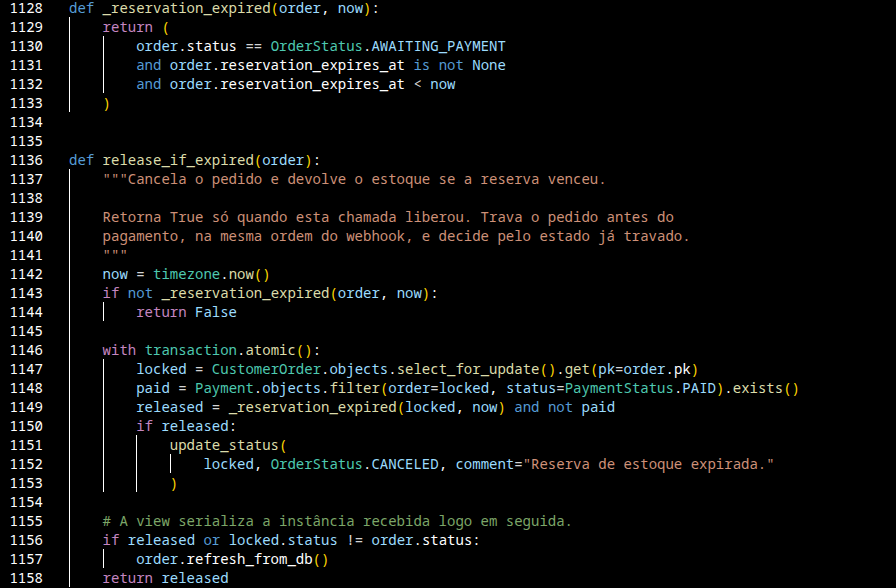
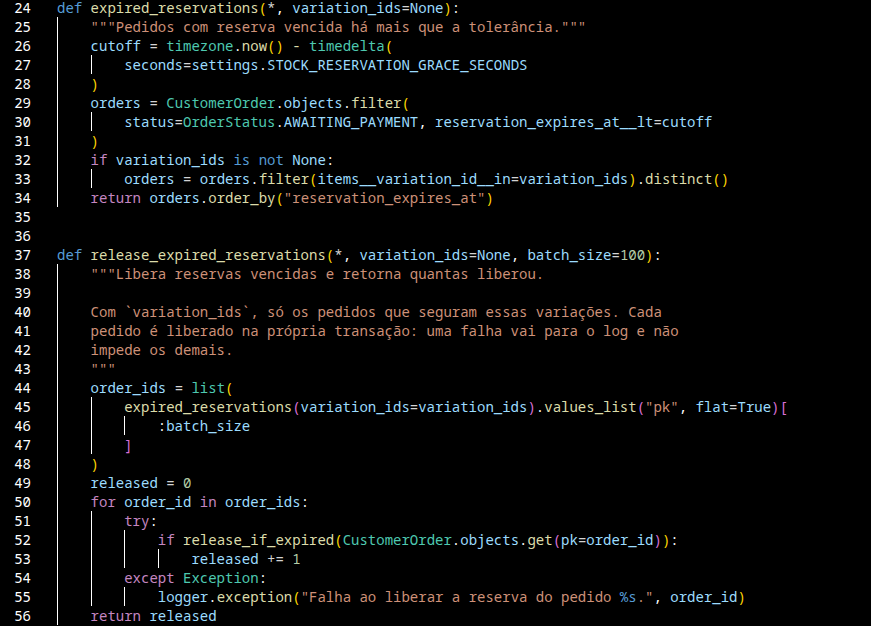
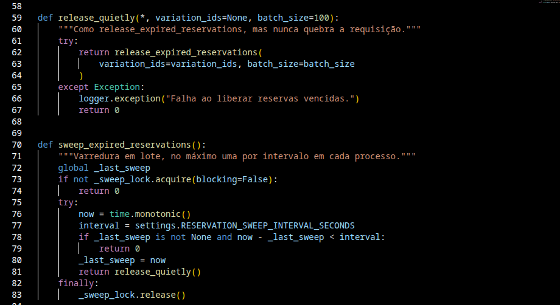
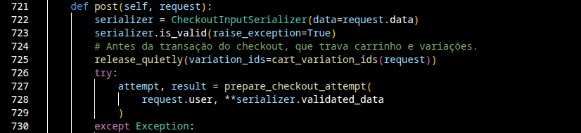
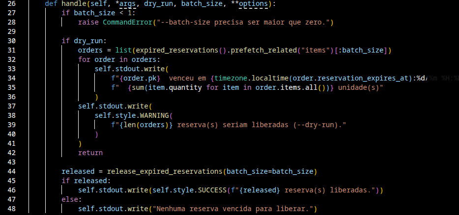
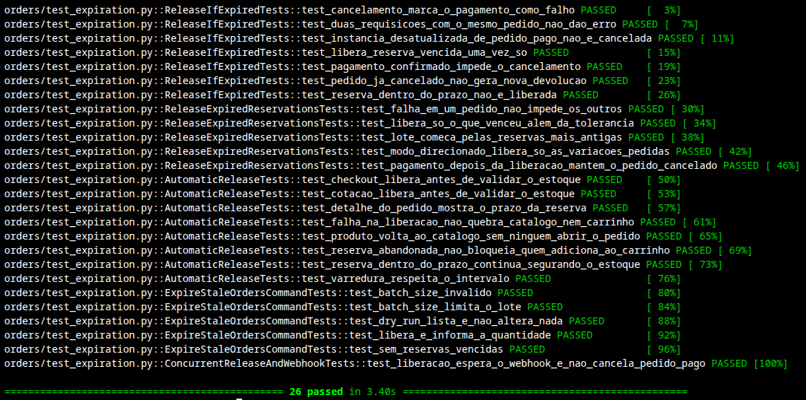

## Expiração automática da reserva de estoque
**Trio:** João Gabriel e João Reis

**Origem:**
- [Issue #43](https://github.com/Shio-Enterprise/Documentacao/issues/43) — automatizar a expiração da reserva de estoque do checkout.

**Por que a melhoria foi relevante?**
Ao finalizar a compra, o estoque fica reservado por 30 minutos enquanto o pagamento não é confirmado. A reserva vencida só era liberada quando alguém abria o detalhe do pedido; sem isso, o estoque ficava preso, novos clientes recebiam "Estoque insuficiente" e, como a listagem pública esconde produtos sem estoque, o produto podia sumir do catálogo.

**Decisões técnicas:**
- O projeto não usa filas de tarefas (Celery) nem cron. A liberação das reservas vencidas é disparada nas próprias requisições de carrinho, cotação, checkout e catálogo, com um comando opcional para agendamento externo.
- A liberação trava o pedido antes do pagamento, na mesma ordem do webhook da InfinitePay, e decide pelo estado já travado: um pedido pago nunca é cancelado e a reserva nunca é devolvida duas vezes.
- As chamadas ficam antes das transações do carrinho e do checkout, que travam as variações em outra ordem, para evitar deadlock.
- Uma tolerância de 2 minutos depois do prazo evita liberar a reserva de quem está pagando no último instante.

**Regras implementadas:**
- Liberação direcionada às variações envolvidas ao adicionar ou alterar item no carrinho, ao abrir o carrinho, na cotação e no checkout.
- Varredura em lote na listagem de produtos e no carrinho, no máximo uma por minuto em cada processo, que devolve ao catálogo os produtos esgotados por reserva abandonada.
- Cada pedido é liberado na própria transação; uma falha é registrada no log e não quebra a requisição nem impede os demais.
- Pagamento confirmado depois da liberação mantém o pedido cancelado, com o pagamento registrado.
- O prazo da reserva (`reservation_expires_at`) aparece no detalhe do pedido e na resposta do checkout.
- Comando `expire_stale_orders` (`make expire`), com `--dry-run` e `--batch-size`, para liberar sem depender de tráfego.

**Evidências (Pull Requests):**
- [Backend PR #24](https://github.com/Shio-Enterprise/backend/pull/24)

**Validações registradas no PR:**
- 26 testes automatizados em `orders/test_expiration.py`, cobrindo liberação dupla sem erro, pedido pago nunca cancelado, reserva abandonada que não bloqueia nova compra, produto que volta ao catálogo, intervalo da varredura, falhas que não quebram a requisição e o comando com e sem `--dry-run`.
- Concorrência entre a liberação e a confirmação de pagamento testada com duas transações reais em Postgres: o teste falha sem a trava e passa com ela.
- Os testes de expiração da O2 continuam passando.

**Evidências (prints):**

### Evidências dos trechos de código do backend

**Liberação segura de uma reserva — `orders/services.py`.** `release_if_expired` trava o pedido, relê o estado e só cancela se a reserva venceu e o pagamento não foi confirmado; retorna se liberou ou não.

**Liberação em lote — `orders/expiration.py`.** Busca as reservas vencidas além da tolerância, das mais antigas para as mais novas, e libera cada pedido na própria transação.

**Varredura sem quebrar a requisição — `orders/expiration.py`.** A varredura roda no máximo uma vez por intervalo em cada processo, e qualquer falha vai para o log em vez de virar erro para o cliente.

**Liberação antes do checkout — `orders/views.py`.** As reservas vencidas dos itens do carrinho são liberadas antes da transação do checkout, que trava carrinho e variações.

**Comando de agendamento — `orders/management/commands/expire_stale_orders.py`.** Libera um lote de reservas vencidas ou, com `--dry-run`, só lista o que seria liberado.

**Testes — `orders/test_expiration.py`.** Testes da liberação, da concorrência com o webhook, da liberação automática e do comando, executados em Postgres.

